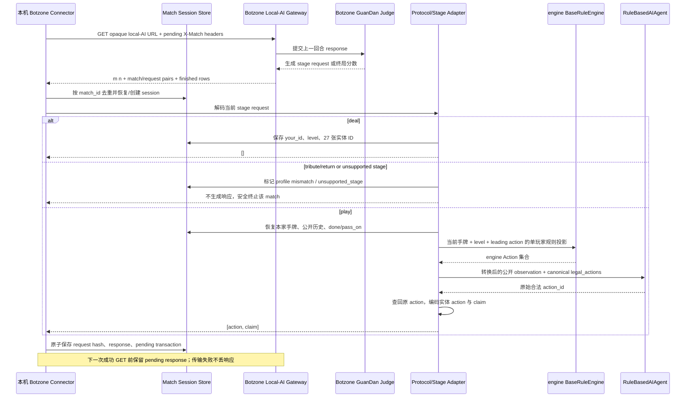

# Botzone 本地 AI 接入计划

更新时间：2026-08-09

## 0. Phase 0：手动建桌无贡 profile 官方协议封板（2026-08-09）

### 0.1 唯一判定

`botzone_manual_no_tribute_phase0_verified`

此判定只针对 `Botzone GuanDan manual-table no-tribute profile` 的官方协议前置；它不改变 K-A3d3b、K-A3d3c2 或 K-A3d3c3a 的任何结论，也不表示 connector 已实现或可启动。该判定只允许进入 L1-A1 的离线协议模型、108 ID codec 和测试，不授权联网、创建桌子、加入对局或调用本地 AI。

### 0.2 仅采用的官方来源

| 来源 | 固定版本 / 核对日期 | 证据类型 | 可直接确认的范围 |
|---|---|---|---|
| [本地 AI](https://wiki.botzone.org.cn/index.php?title=%E6%9C%AC%E5%9C%B0AI&oldid=2230) | `oldid=2230`；2026-08-09 | 官方 Wiki 词条与官方 Python/C++ 样例 | GET 长轮询、`m n` 首行、`2*m` match/request 行、finished row、`X-Match-<match_id>`、多 match、`runmatch` Headers。 |
| [Bot](https://wiki.botzone.org.cn/index.php?title=Bot&oldid=2245) | `oldid=2245`；2026-08-09 | 官方 Wiki 词条 | 常规 Bot 的 JSON/simple-IO 历史语义；不能把它当作 local-AI 网关重放保证。 |
| [GuanDan](https://wiki.botzone.org.cn/index.php?title=GuanDan&oldid=2497) | `oldid=2497`；2026-08-09 | 官方 Wiki 规则、字段定义与 request/response 样例 | 108 ID、`deal`/`tribute`/`return`/`play`、`[action, claim]`、pass、近四手 history、`global` 字段。 |
| [GuanDan 游戏详情](https://www.botzone.org.cn/game/GuanDan) | 2026-08-09 | 用户从官方详情页“裁判代码”提供的源码副本 | 31,136 bytes，SHA-256 `20d06056689341e1745837564dfae325bd56e54c7b0337bc11c6e8c856bc6b46`；确认 claim 校验、双配子能力、无贡 initdata、四次 deal 后首个 play。 |
| 目标账号“本地 AI 配置”页面 | 2026-08-09 | 登录后脱敏权限截图 | **confirmed**：目标账号可见密钥、连接 URL、连接状态和提交控件，页面显示当前账号适用门槛；真实密钥/URL 已暴露后必须轮换，文档不记录其值。 |

所有 URL、版本和内容只用于文档引用；不记录本地 AI URL、连接密钥、match ID、Header 值、账号身份或个人资料。

### 0.3 confirmed / unsupported / unknown

| 项目 | 状态 | 官方依据或边界 | 对手动无贡路径的影响 |
|---|---|---|---|
| 108 ID 映射 | **confirmed** | 每副为 `0..53`；普通牌按 `h,d,s,c`，从 A、2 到 K；`52` 小王、`53` 大王；`54..107` 重复。 | 可进入后续离线 codec 设计；当前 `engine.cards` 的 `S,H,C,D` 和无副本模型不能直接当作平台 ID。 |
| `deal` | **confirmed** | `stage="deal"`，`deliver` 为本家 27 张实体 ID，`your_id` 为座位；response 是 `[]`。 | 可作为无贡 profile 的允许 stage。 |
| `play` 基础形状 | **confirmed** | response 是 `[action, claim]`；两者均为整数 ID 数组；无配子时二者相同；pass 精确为 `[[], []]`。 | 普通牌和 pass 的协议形状可封板。 |
| `play.history` | **confirmed** | 裁判固定维护四槽窗口；无贡首个 play 为 `[[],[],[],[]]`，之后以 `history[1:] + current_move` 滑动，真实项含 `player/response`。 | parser 必须规范化前缀空槽；session 仍需持久化近四手之外的公开状态。 |
| `global.level/resist`、`done`、`pass_on` | **confirmed from referee source** | 无贡 play 的 `global.resist=false`；`done` 按出完顺序追加；`pass_on` 为 `-1` 或刚出完、尚待接风处理的玩家。 | 必须 stage-specific 严格解析；adapter 按裁判的 latest-window 扫描语义重建 free/follow，不自行猜测。 |
| 配子实体 | **confirmed** | 红桃级牌是配子，可代替任意非大小王牌。 | 与本地 `carrier_cards` / `wildcard_info` 的概念可对接，但不足以编码 claim。 |
| 配子 claim 的花色、副本、排序、重复和 canonical 规则 | **confirmed with strict adapter policy** | 裁判源码 `isLegalClaim()` 按牌面多重集匹配所有非配子 action，剩余 claim 牌对应配子且不得为王；ID 经单副牌牌面投影，因此两副副本等价，顺序不参与校验。裁判未严格拒绝 claim 重复实体 ID 或越界整数。 | adapter 必须比裁判更严格：只输出 `0..107`，自然牌固定 `claim=action`，声明使用确定性 canonical ID，不依赖裁判宽松行为。 |
| 单手配子数量及多配子牌型约束 | **confirmed** | 物理牌池只有两张红桃级牌；源码允许所有红桃级牌从自然牌匹配中豁免，并明确存在“bomb with 2 coverings”路径，随后统一用 claim 做牌型判断。 | Botzone 最多允许两张配子；当前 engine 每手最多一个配子，只实现合法子集并记录能力缺口，不修改 engine。 |
| 无贡手动桌首个 `play` 先手 | **confirmed** | 源码把缺失/0 `tribute` 规范为 0，`first/last=None`；四家 deal response 完成后直接生成 `stage="play"`，`nextplayer=0`。 | adapter/session 以 Botzone 玩家 0 为无贡新桌首个先手，再映射为本地玩家 1。 |
| 无贡时严格跳过 `tribute/return` | **confirmed** | 源码在 `tribute==0` 分支直接发首个 play；只有 truthy tribute 才进入 tribute 分支。 | 无贡 profile 正常阶段为 deal→play；仍需识别意外 `tribute/return` 并 fail-closed。 |
| 贡/还/抗贡/双贡/跨局升级 | **unsupported** | 当前项目只实现单局 play；无 tribute/return/resist/升级状态模型。 | 任何此类 stage 一律 `unsupported_stage`，不调用 Agent、不伪造 pass。 |
| local-AI GET / Header / 批量 match | **confirmed** | 本地 AI词条规定 GET、首行 `m n`、request/finished 行和 `X-Match-<match_id>`；样例按每 match 维护 pending response。 | connector 只能作为后续实现；当前不实现。 |
| local-AI 重放、提交成功确认、服务端超时秒数 | **unknown** | 官方样例在 URL/HTTP error 后重试，但没有给出 exactly-once ack 或固定长轮询秒数。 | 后续 connector 需保守持久化 pending response；不得承诺重放语义。 |
| `runmatch` / `X-Initdata` 无贡表达 | **unknown — optional** | 官方只定义 `X-Initdata` 为可选初始化数据，未给 GuanDan 无贡值。 | 仅阻塞自动建桌；不阻塞手动建桌的 Phase 1–3。 |
| 目标账号可用本地 AI | **confirmed** | 登录后页面显示本地 AI 配置入口、提交按钮和连接状态。 | 不再阻塞离线实现；真实 smoke 前必须轮换已暴露密钥并重新取得联网授权。 |

### 0.4 action / claim 与当前 engine 的封板

已确认的无歧义部分：

- `Action.make_pass()` 必须编码为 `[[], []]`；
- 无配子的 canonical action 只能把同一组**真实实体 ID**同时填入 action 与 claim；
- action 是真实 carrier，claim 是配子替代后的声明；两副相同牌必须在 session inventory 中保留原 ID，不能仅按 token 扣牌；
- 当前 `Action.carrier_cards`、`Action.declared_cards` 和 `WildcardInfo` 是 adapter 输入候选，而不是 Botzone 输出真值。

官方源码确认的 claim 行为：

- action 与 claim 必须等长；所有非红桃级牌按花色+点数多重集出现在 claim 中；
- 剩余 claim 项与配子一一对应，不能声明为大小王；同花顺等牌型由 claim 的声明花色参与判断；
- 两副相同牌在 claim 中等价，顺序不参与裁判语义；自然牌仍采用更严格、稳定的 `claim=action`；
- 两张红桃级牌可以同时作为配子，最终声明统一进入牌型识别；
- 裁判对 claim ID 范围和重复实体 ID 的检查较宽松，integration 必须自行限制 `0..107` 并生成确定性 canonical 声明。

上述证据允许 L1-A1 实现离线 codec/protocol；play adapter 仍属于 Phase 3，必须经过 Phase 1/2 测试后才能实现。

### 0.5 无贡手动桌与 transport 的操作边界

用户侧手动操作的唯一目标 profile 为“建桌时选择需要进贡=否”。官方裁判源码确认四家依次完成 `deal` 后直接向 Botzone 玩家 0 发出首个 `play`。未来 dispatcher 只允许该 profile 的 `deal/play`，遇到 `tribute`、`return` 或未知 stage 必须停在 `unsupported_stage`。

本地 AI 官方词条确认：手动创建或加入桌后可选择“用本地AI替代我”；local-AI 是本机向 opaque URL 发起 GET 的长轮询，不是本机开放端口。一次 GET 可以包含多个 match，finished row 的玩家数为 `0` 表示异常结束。真实 URL、Header 值和 response 内容均不进入文档、日志或测试 fixture。

## 1. 任务目标与可行性结论

任务编号：Step L（Botzone 本地 AI 接入）。

目标是在不改变现有 AI 边界的前提下，让本机连接器通过 Botzone 本地 AI 接口参与 GuanDan 测试对局，用真实平台对手验证 RuleBasedAI 或其他本地策略的合法性、稳定性和实际对抗表现。

第 0 节的 `botzone_manual_no_tribute_phase0_verified` 是当前唯一 Phase 0 判定；它只允许进入离线 Phase 1，不构成 connector、adapter 或真实桌授权。

- 本地 AI 传输层可行性高：官方协议是由本机发起的重复长轮询 GET，不需要公开本机端口，也不是上传源码或 WebSocket。
- claim、双配子和无贡阶段流已由官方裁判源码封板；下一步先实现离线协议模型和 codec，不跨越到 connector/adapter。
- 用户提供的建桌设置截图确认“需要进贡”可选择“否”，且默认测试对局采用该配置；因此首期真实 smoke 的支持范围可以收敛为 `deal + play`。
- 当前 engine 没有贡还能力不再阻塞无贡模式接入；但 adapter 必须识别 `tribute / return` 并以 `unsupported_stage` fail-closed，不能返回空响应、pass 或任意牌绕过。
- Botzone 允许最多两张配子，而当前 engine 每手最多一个配子；首期 adapter 只能声明支持当前 engine 可生成的合法子集。
- 首期使用网页手动建桌并明确选择“需要进贡=否”；`runmatch X-Initdata` 只属于后续自动化能力，其未知状态不再阻塞 Phase 1–3 或手动 smoke。
- RuleBasedAI 可作为第一阶段默认 AI，但它只保证从合法动作中稳定选择，不代表已有强对抗能力。真实 smoke 只能证明接入正确；实力判断需要座位平衡和固定对手的小批量统计。

本任务不得改变以下边界：

- `engine/` 继续提供出牌规则真值；
- `agents/` 只接收转换后的公开 observation 和 canonical `legal_actions`，只返回原始合法 `action_id`；
- adapter 查找该 `action_id` 对应的原始 action 后再编码 Botzone response；
- Agent 不得生成 Botzone 牌 ID、`action` 或 `claim`；
- 真实连接 URL 和密钥仅作为不透明的环境变量或启动参数传入，不写入源码、测试、文档示例或日志；
- 第一阶段默认使用 `RuleBasedAIAgent`，不使用 DeepSeek。
- 支持范围固定标记为 `Botzone GuanDan no-tribute profile`；贡还模式和跨局升级均为非目标。

## 2. 已核实的官方协议

以下事实来自 Botzone 官方页面，核对日期为 2026-08-05：

- [本地AI词条](https://wiki.botzone.org.cn/index.php?title=%E6%9C%AC%E5%9C%B0AI)，固定版本 `oldid=2230`；
- [Bot 交互词条](https://wiki.botzone.org.cn/index.php?title=Bot)，固定版本 `oldid=2245`；
- [GuanDan 词条](https://wiki.botzone.org.cn/index.php?title=GuanDan)，固定版本 `oldid=2497`；
- [GuanDan 游戏详情](https://www.botzone.org.cn/game/GuanDan)。

### 2.1 本地 AI 传输

1. 用户手动创建/加入游戏桌并勾选“用本地AI替代我”，或调用官方 `runmatch` API。
2. 本机连接器向账号页面生成的本地 AI URL 发起 GET；该 URL 包含敏感身份和密钥，程序必须整体当作 opaque secret。
3. GET 可能阻塞到有新 request 或服务端超时，属于长轮询，不是长连接流或 WebSocket。
4. 返回文本首行为 `m n`：有新 request 的对局数和已结束对局数。
5. 后续 `2*m` 行按“match ID、该回合 request”成对出现；再后续 `n` 行是结束信息。
6. 连接器把已完成 response 放入下一次 GET 的 `X-Match-<match_id>` Header。
7. 一次轮询可同时承载多个 match，必须按 match ID 隔离状态。
8. 结束行包含 match ID、本地 AI 座位、玩家数和各玩家分数；玩家数为 0 表示对局异常终止。
9. 官方未规定固定的服务端长轮询秒数；样例只在 URL/HTTP 错误或超时后等待并重试。

`runmatch` 官方 Header 为 `X-Game`、`X-Player-0..n` 和可选 `X-Initdata`。参与者必须有且只有一个 `me`；其他位置填写 Botzone 已有 Bot ID。创建成功返回 match ID。

### 2.2 Bot 通用交互与本地 AI 的区别

- 普通短生命周期 Bot 的 JSON 输入包含该 Bot 过去全部 `requests/responses`，并可携带 `data/globaldata`。
- GuanDan Wiki 中展示的是单回合游戏 request；本地 AI 网关按官方词条优先返回 simple-IO request，并由连接器自身持续运行。
- 本地 AI 专用接口没有承诺在连接器重启后重放整场历史，也没有说明会转发普通 Bot 的 `data/globaldata` 外层对象。
- 因此不能把普通 Bot 的“完整 requests/responses”保证直接套到本地 AI 连接器；连接器必须有自己的按局恢复机制。

### 2.3 GuanDan 阶段与数据

- 牌 ID 为 `0..107`。`0..53` 是第一副牌，`54..107` 重复同一牌面。
- 每副牌中普通牌按 `h, d, s, c` 排列；`0..3` 为四种花色的 A，`4..7` 为四种花色的 2，依次到 K；`52/53` 为小王/大王。
- `deal`：request 含 `deliver` 27 张牌和 `your_id`；response 是空数组。
- `tribute`：需要进贡；response 是贡牌 ID 数组。
- `return`：需要还贡；response 是还牌 ID 数组。
- `play`：response 为 `[action, claim]`。`action` 是真实打出的 ID；`claim` 是配子替代后的声明牌型。没有配子时二者相同；pass 为两个空数组。
- `play.history` 只包含近四手、包括 pass；每项含 `player` 和同结构 response。
- `done` 标记已出完玩家；`pass_on` 表示接风上下文。
- `global` 总是提供 `level`，并可能提供 `tribute`、上一局 `first/last`、`resist`、`tribute_cards`、`return_cards`。
- 用户提供的当前建桌 UI 显示“需要进贡”可选“否”；本项目只支持该无贡配置。该截图用于确认项目配置范围，不替代官方协议或裁判语义文档。
- 平台协议仍可能出现 `tribute / return`；在本项目无贡 profile 中出现这些 stage 代表建桌配置或协议状态不符合支持范围，必须安全终止该 match。

## 3. 协议与规则差异表

| 维度 | 当前项目 | Botzone GuanDan | 处理位置 / 结论 |
|---|---|---|---|
| 玩家编号 | `1..4`，1/3 与 2/4 组队 | `0..3`，0/2 与 1/3 组队 | adapter 固定 `botzone_id + 1`，测试座位和队伍保持 |
| 牌面编码 | `Card(rank, suit)` / token；无副本 ID | `0..107`，两副牌 ID 不同 | `cards.py` 保留 ID inventory；token 仅给 engine/Agent |
| 花色顺序 | token 使用 `S/H/C/D` | ID 余数顺序 `h/d/s/c` | 明确映射，不依赖枚举顺序 |
| 点数顺序 | token `A,2..K,SJ,BJ` | 每副牌普通 ID 从 A、2 到 K，再 joker/Joker | 公式+108 张穷举测试 |
| 发牌 | `reset()` 自己洗牌并给四家 27 张 | `deal.deliver` 只给本家 27 张 | 不调用随机 reset；session 接受平台发牌 |
| 副本身份 | 两张同花同点不可区分 | 两张同牌有不同 ID | 输出前按当前 ID multiset 决定实体 ID，不能只反向 token |
| 局前阶段 | 无 | 建桌可选择是否进贡；协议定义 `tribute / return / resist / double tribute` | 仅支持“需要进贡=否”；识别其他 stage 后 `unsupported_stage`，不实现策略 |
| 开局领牌者 | 构造参数 `starting_player_id` | 官方裁判无贡分支在四次 deal 后选择玩家 0 | adapter 映射为本地玩家 1；非无贡 profile 不适用 |
| 出牌历史 | engine 保存完整 history | request 只给近四手 | session 去重累计公开事件；不能只看单次 request 做全局统计 |
| 完赛/接风 | engine 内部推进并公开 finish order | `done`、`pass_on` | adapter 转为公开 observation；过渡需去重 |
| 合法动作 | `BaseRuleEngine` 输出 `Action`，`GuanDanGame` 分配 `action_id` | 平台要求 ID 数组 | integration 构造单玩家 `GameState` 投影并序列化 canonical actions |
| pass | canonical pass action | `[[], []]` | action adapter 固定转换 |
| 普通出牌 | `carrier_cards` 与 `declared_cards` | `action` 与 `claim` 相同 | 用 inventory 中实际 ID 同时填两边 |
| 配子出牌 | carrier 与 declared 分离，`wildcard_info` 显式 | `action` 与 `claim` 等长；非配子牌面守恒，剩余声明非王 | 只从被选 canonical action 转换；输出严格 canonical ID |
| 配子数量 | 当前实现每手最多 1 张 | 两副牌最多两张红桃级牌，裁判允许两张同时替代 | 当前 engine 仅覆盖合法子集；不为接入修改 engine |
| 牌型/比较 | 当前 SPEC 的单局规则 | Wiki 规则文字相近，但未完整给出所有 judge 比较细节 | Phase 0 建立官方差异 fixture；不以名称相同视为等价 |
| 终局结果 | engine 自己计算 winner/draw | gateway 结束行给各玩家 score | 以平台结束结果为审计真值；本地结果只用于测试 |
| 跨局升级 | 不支持 | 建桌可显式设置双方等级和上一轮名次 | 只消费当前测试桌给出的本局公开配置；不实现升级赛或贡还 |

## 4. 推荐目录与模块职责

建议使用 `integrations/botzone/`，不在 `engine/`、`agents/` 或现有 `cli/` 中加入连接逻辑：

```text
integrations/
  botzone/
    __init__.py
    models.py
    cards.py
    protocol.py
    session.py
    profile.py
    play_adapter.py
    runner.py
    connector.py
    __main__.py
```

| 模块 | 职责 | 禁止事项 |
|---|---|---|
| `models.py` | frozen/slots 的 poll、match result、stage request、pending response 数据模型 | 不读环境、不联网 |
| `cards.py` | 108 ID 双向映射、ID inventory、确定性实体牌选择 | 不丢副本 ID，不做策略 |
| `protocol.py` | 解析 `m/n` 文本、编码/校验 `X-Match-*`、解析 GuanDan stage JSON | 不调用 Agent，不重试网络 |
| `session.py` | match ID 隔离、事件去重、手牌/人数/完成状态、pending response 和持久化恢复 | 不保存 URL/密钥，不依赖单例全局状态 |
| `profile.py` | 验证无贡配置；允许 `deal/play`，识别并拒绝 `tribute/return` | 不实现贡还策略，不用空响应或随意动作绕过 |
| `play_adapter.py` | Botzone 公共请求→engine 规则投影→observation/legal actions；action ID→`[action, claim]` | 不让 Agent 看 Botzone ID，不调用 engine 私有状态 |
| `runner.py` | 按 stage 调度；play 默认调用 `RuleBasedAIAgent`；统一 fail-closed | DeepSeek 不作为默认值 |
| `connector.py` | 可注入 transport 的长轮询、超时/退避、批量 Header、完成通知和脱敏日志 | 不输出完整 URL/Header/response |
| `__main__.py` | 独立启动入口 | 不修改现有 `cli/run_4ai_debug.py` |

第一版优先使用标准库 HTTP 客户端，不新增依赖。连接配置模块不得导入会自动读取仓库 `.env` 的配置路径；只从显式环境变量或启动参数取得 opaque URL。环境变量名称可以文档化，但不得给出真实或可用示例值。

## 5. 完整消息流



关键边界：Botzone Gateway 只与 connector 通信；Agent 不直接接触网络、match ID、Botzone 牌 ID、连接 URL 或 Header。

## 6. 状态、持久化与重连

### 6.1 会话状态

每个 match ID 独立保存：

- 协议版本和 stage；
- `your_id`、level、已确认的无贡 profile 和必要公开本局配置；
- 初始和当前本家 Botzone ID multiset；
- 去重后的公开 play 事件、各玩家剩余张数、done 顺序和 pass_on；
- 最新 request digest、已生成 response、pending/acknowledged 状态；
- 不含密钥的诊断计数。

### 6.2 持久化策略

- 内存 map 只作工作集，不能作为唯一真值。
- 每次生成 response 前后使用原子 snapshot 或 append-only journal，目录位于显式 runtime state dir，不放在仓库 `logs/`。
- snapshot 不保存本地 AI URL、密钥、完整 HTTP Header 或环境变量。
- 相同 request digest 必须返回完全相同 response，避免重试导致策略随机漂移。
- 只有携带 pending Header 的 GET 成功返回后，才把该 pending transaction 标为已发送；传输异常时保留并重发同一 response。
- 收到 finished row 后归档最小聚合结果并删除活动手牌状态。
- 启动时若收到非 `deal` request 且本地无可恢复 session，整体 fail-closed，不猜手牌、不伪造 pass；收到 `tribute/return` 同样 fail-closed。

### 6.3 历史恢复边界

Botzone `play.history` 只有近四手，不足以恢复本家当前手牌和完整公开历史。正常运行依赖本地 durable session；不能声称仅靠当前 request 可从任意中途恢复。后续若官方确认本地 AI 会重放全部历史，可再简化，但实现前不得假设。

## 7. 分阶段实施计划

### Phase 0：官方协议核实与差异清单

状态：已完成。官方裁判源码、官方 Wiki 与目标账号脱敏配置页证据已封板，唯一判定为 `botzone_manual_no_tribute_phase0_verified`。后续 L1-A1 与 L2-A1 均已完成；runmatch 自动建桌仍是可选后续能力。

工作：

- 保存官方页面固定版本、核对本地 AI poll/Header/runmatch 协议；
- 从官方 GuanDan 裁判源码或脱敏真实调试 Log 确认 claim、配子数量和无贡模式的 request 顺序；
- 把“需要进贡=否”定义为唯一支持的 Botzone profile，并确认手动建桌可以稳定选择该配置；
- 核实 `runmatch` 的 `X-Initdata` 如何无歧义表达“需要进贡=否”；未确认前不使用 runmatch，但不阻塞手动建桌路径；
- 在登录后的账号设置页确认当前部署的本地 AI 等级门槛；
- 建立不含真实 URL、密钥、match ID 或手牌的协议差异表和脱敏 fixture 清单。

验收：

- 所有字段标为 confirmed/unsupported/unknown，不以第三方实现补官方空白；
- `deal/play` 的字段与顺序有官方依据；`tribute/return` 能被精确识别并返回统一 unsupported 诊断；
- claim 编码可无歧义映射当前 canonical action；
- 确认账号权限和手动桌选择方式；runmatch 前置可保持独立 unknown；
- 未读取或持久化任何真实密钥。

以上条件已满足，L1-A1、L2-A1 与 L2-A1a 已完成；当前必须先完成 L2-A1b 官方请求契约补全，不得跳过 Phase 3 直接真实连接。

### Phase 1：纯协议模型与卡牌映射

状态：已完成，唯一判定 `botzone_no_tribute_protocol_verified`。定向 14 项、全量 460 项通过；实现已形成独立检查点 `db8f351f2b416a67ab13ae35de6923aefa2ae859`。

工作：已实现 `models.py/cards.py/protocol.py` 和三份离线测试；不联网、不调用 Agent。

验收：

- 108 个 ID 全量双向映射；两副同牌 round-trip 后仍保留原 ID；
- `deal/play` request/response 严格编解码；`tribute/return` 至少严格解析 stage 标识并以 unsupported 结果拒绝；
- deal/play/pass、claim、多配子、无贡 opening 和 unsupported stage 已有测试；
- poll 的多 request、finished、CRLF/LF 与 Header 注入明确转入 Phase 2；
- 不读取配置、环境变量或 `.env`。

### Phase 2：连接器骨架与 mock Botzone

状态：L2-A1 已提交为 `3b1b75ba1811f629f91718e5997ec9955c524b73`。L2-A1a 定向 34 项、全量 480 项通过，历史判定 `botzone_phase3_admission_contract_verified`；其六个修改文件尚未形成独立检查点。官方首个 play 精确复核后，Phase 3 前还需执行 L2-A1b。

工作：实现 poll 文本模型、可注入 fake transport、session store 和 pending response 事务；只连 mock transport。本阶段不提供真实 HTTP transport或 live module 启动入口。

验收：

- mock 覆盖阻塞 poll、超时、HTTP 错误、重试、多 match 和 finished；
- 失败重试不丢失或改变 pending response；
- 重复 request 幂等；多会话手牌/历史完全隔离；
- 进程重启后从临时 state dir 恢复；无状态中途 request fail-closed；
- 日志和异常不含 URL、密钥或完整 Header。
- 通过后唯一判定 `botzone_mock_connector_verified`；仍不得声称 connector 可连接真实 Botzone。

Phase 3 准入审计新增硬门槛：

- claim 对虚拟声明 ID 必须允许官方裁判接受的重复，覆盖 9/10 张配子炸弹；action/known hand 仍保持实体唯一；
- handler 必须接收按 match 隔离的不可变 session context，不能只收到无手牌的 `PlayRequest`；
- pending response 必须携带 action 实体 ID effect，只在 transport 成功 acknowledge 后原子扣牌一次；
- latest four history 必须可验证地并入累计公开事件；无法对齐时 fail-closed。

L2-A1b 已通过 `botzone_phase3_official_request_contract_verified`。L3-A1 随后完成离线 RuleBased adapter，检查点为 `39bd881f7155a35a49f989910be7dcd8bd23e02a`。L3-A1a 已封板精确 observation 与实体守恒，检查点为 `253159f7cf00e9995cc986bac816bf67a8596a4e`，判定 `botzone_adapter_observation_hardening_verified`。L4-A1 离线 HTTP connector/runner 也已完成，当前不直接 live。

### Phase 3：连接 RuleBasedAI 的端到端回合测试

状态：L3-A1 主链与 L3-A1a 加固均已完成；公开 observation、外部 wildcard table action、实体守恒和 context 一致性已封板。

工作：实现 `profile.py/play_adapter.py` 和可注入现有 mock connector 的 RuleBased handler，完成无贡 profile 的 `deal + play` 链路；不提供 CLI/module runner，不联网、不实现贡还路径。

验收：

- adapter 只用公开 request/session 生成 observation 和 legal actions；
- `RuleBasedAIAgent` 返回值经 `require_legal_action_id` 和原始 action 映射双重验证；
- pass、自然出牌、配子 action/claim、接风和玩家完成均通过；
- 每个输出都可追溯到原始 legal action，未知输入不伪造动作；
- 单玩家规则投影与 `GuanDanGame.legal_actions()` 在可构造同状态 fixture 上等价；
- deal→多轮 play 的脱敏端到端脚本完成；
- 任一 `tribute/return` 输入都不调用 Agent、不生成动作，并稳定返回 `unsupported_stage`；
- 通过后只能标记 `botzone_no_tribute_adapter_verified`，不得标记完整 Botzone GuanDan 支持。

L3-A1a 验收补充：

- current/history round 来自同一次累计公开历史重放；同轮连续跟牌不新开 round；
- table action 使用 `action_id=None`，history 只含公开六字段，本家手牌稳定排序；
- 外部自然牌及一/双配子动作重建 canonical declared cards、wildcard info 与稳定 display；
- 实体 action ID 全局唯一，本家 27 张与公开出牌守恒，done/未完成容量边界 fail-closed；
- global/window/history/local/finished 矛盾在 Agent 创建前拒绝；
- 判定 `botzone_adapter_observation_hardening_verified` 不代表存在可用 live connector。

### Phase 4 准备：离线 HTTP connector 与 runner

状态：L4-A2c5a 契约已封存；L4-A2c5b 真实环境 preflight invalid；L4-A2c5b1 已定位到独占创建原子操作。下一步 L4-A2c5b2 只做脱敏错误分类和目录范围对照。

工作：

- 使用标准库实现可注入 opener 的 HTTPS GET transport；
- 仅从显式启动参数或进程环境读取敏感 URL 与 state dir，不加载 `.env`；
- 组合现有 session、connector 与 `NoTributeRuleBasedHandler`，提供前台 module runner；
- 在 fake gateway 下验证批量 Header、pending resend/ack、重启、退避和退出；
- 默认 Agent 保持 RuleBasedAI，不自动建桌、不使用 runmatch、不联网。

验收：

- URL、Header、match ID、请求/响应正文和手牌不进入日志、异常、snapshot 或测试 fixture；
- 只允许 HTTPS，拒绝重定向、Header 注入、无限响应和无限等待；
- 单次 transport 不重试，runner 采用有上限退避，成功后重置；
- fake gateway 的 `deal → play → failure → restart → resend → ack` 保持 response/effect 幂等；
- 配置错误、transport 错误、Ctrl+C 和 unsupported stage 有稳定退出行为；
- 全程无 socket/真实网络；通过后唯一判定 `botzone_local_connector_offline_verified`。

L4-A1 已实现：

- 标准库 HTTPS GET、注入式 opener、无 body、响应大小限制、重定向拒绝和脱敏错误；
- 仅显式参数或 `BOTZONE_LOCAL_AI_URL` / `BOTZONE_STATE_DIR` 的 runtime 配置；
- 前台循环、确定性退避、failure limit、有限 cycle、Ctrl+C 与 module 入口；
- fake gateway 的 pending failure/restart/resend/ack 与多 match 回归；
- 未读取 `.env`、未联网、未调用 DeepSeek。

L4-A1a 已通过的 live 准入硬门槛：

- runner 按 `stop_after_finished`、wall time、cycle、failure 与 fatal diagnostic 有界停止；
- 非 transport diagnostic、尤其 `unsupported_stage`，立即 fail-closed；
- finished 后活动 session 删除或降为不含 match ID、手牌、history、response/digest 的最小 tombstone；
- response 全路径关闭，Header 名为严格 ASCII token；
- stable exit code 和最小聚合 audit，不输出 URL、state dir、match ID、Header 或正文；
- `preflight-only` 验证仓库外绝对 state dir 与配置，但零 opener/零网络；
- 通过后唯一判定 `botzone_live_smoke_preflight_ready`，仍不得自动联网。

L4-A2a 只读前置审计已完成：

- 先把 L4-A1a 十个 runtime/session/test 文件独立封存并保持工作区干净；
- 用户明确确认截图中暴露过的 Botzone 连接凭据已轮换；不得读取或比较 URL 来代替确认；
- 只检查 `BOTZONE_LOCAL_AI_URL` / `BOTZONE_STATE_DIR` 在当前进程中存在，不输出值、host、path、长度或 hash；
- state dir 与 audit dir 为仓库外全新目录；运行一次 `--preflight-only` 后仍为空；
- 不启动 connector、不发送 probe、不创建对局；
- 判定 `botzone_live_smoke_authorization_ready`；用户已明确授权固定预算的一次 L4-A2b live run。

L4-A2b 启动门槛修正：

- 实现基线固定为 `029b8d6034e55c70b83d2b1c8d4b052626895bd2`，要求它是执行时 HEAD 的祖先，不要求精确 HEAD 相等；
- 实现检查点之后只允许五份规划文档变化：`docs/BOTZONE_INTEGRATION_PLAN.md`、`docs/NEXT_PROMPT.md`、`docs/PLAN.md`、`docs/PROJECT_STATUS.md`、`docs/TESTS.md`；
- 发现代码、测试、配置或其他路径变化时 fail-closed；
- 先前 `checkpoint_head_mismatch` 未启动 connector、未发送 GET，属于前置误判，不消耗授权或 live run 次数。

### Phase 4：真实 Botzone 小规模 smoke test

结果：L4-A2b 启动前门槛全部通过，但唯一 `Start-Process` 调用在 connector 进程创建前失败。未发送 GET，未产生 live audit/state，未重试或启动第二进程；唯一判定 `botzone_no_tribute_local_ai_smoke_invalid`。该结果不证明 connector 或 Botzone 协议失败，只证明本次启动链不完整。

工作：

1. 使用锁定预算启动前台 connector：RuleBasedAI、100 cycles、600 秒、30 秒 timeout、连续失败 5、finished 1 局即停；再手动创建测试桌，明确把“需要进贡”设为“否”，只验证一局 deal 到终局；
2. 只有在官方资料确认 `X-Initdata` 的无贡表达后，才用 runmatch 与三个指定现有 Bot 创建至多四局，并让 `me` 轮换四个座位；
3. smoke 通过后，可另行预注册固定对手的小批量观察性对抗评测。

验收：

- 无非法 response、超时、断线丢状态或跨局污染；
- 实际只出现已支持的 deal/play；若出现 tribute/return，则该局按配置错误失败，不计为接入成功；
- 保存聚合的完成数、异常数、座位、平台 score 和耗时，不保存请求正文、手牌、match URL 或密钥；
- smoke 只证明接入可用，不声明胜率提升；实力结论至少需要座位平衡、固定对手和预注册局数。
- 第一局 smoke 必须使用仓库外全新 state/audit 目录；结束后只保留脱敏聚合 audit，活动 session 中不得残留手牌或 match ID。

### Phase 5：可选 DeepSeek

前置：RuleBasedAI 的 Phase 4 完整通过，且另行取得 DeepSeek 与 Botzone 两个外部网络面的明确授权。

验收：

- 默认仍为 RuleBasedAI，DeepSeek 必须显式开启；
- Botzone 每回合时限、模型超时和 fallback 预算有硬上限；
- 模型失败仍只能回退到原始 legal actions；
- 不把 DeepSeek API key 与 Botzone URL/密钥写入同一日志或审计文件；
- 不作为 Botzone 基础接入验收条件。

## 8. 计划新增的测试

| 测试文件 | 主要场景 |
|---|---|
| `tests/test_botzone_cards.py` | 108 ID 全覆盖、A/2/K/王边界、花色、两副副本、非法 ID |
| `tests/test_botzone_protocol.py` | poll `m/n`、多局、finished/aborted、stage JSON、Header 注入、malformed fail-closed |
| `tests/test_botzone_profile.py` | 无贡 profile、deal/play 允许、tribute/return 明确 unsupported、未知 stage 拒绝 |
| `tests/test_botzone_session.py` | request 去重、手牌 ID inventory、history 累积、多局隔离、snapshot/restart、无状态中途恢复失败 |
| `tests/test_botzone_play_adapter.py` | 0/1-based 座位、公开 observation、table constraint、pass、自然牌、配子 carrier/claim |
| `tests/test_botzone_action_provenance.py` | 所有输出来自原始 legal action ID；非法/过期/其他会话 action ID 拒绝 |
| `tests/test_botzone_adapter_observation.py` | 轮次重放、精确公开 key、外部 wildcard table action、实体守恒与 context 一致性 |
| `tests/test_botzone_connector.py` | mock GET、阻塞/超时/断线、pending 重发、批量 Header、敏感信息脱敏 |
| `tests/test_botzone_rule_agent_e2e.py` | RuleBasedAI 的 deal→关键 play 回合、终局和无贡 profile 边界 |
| `tests/test_botzone_http_transport.py` | GET/Header、timeout、重定向、响应上限、response close、严格 ASCII Header、错误脱敏与 fake opener |
| `tests/test_botzone_runtime_config.py` | 只读显式环境/参数、缺失配置、仓库外绝对 state dir、preflight-only、未导入 dotenv/根 config |
| `tests/test_botzone_runner.py` | 依赖装配、退避/重置、finished/wall/cycle/failure/diagnostic 停止、退出码与零真实网络 |
| `tests/test_botzone_live_preflight.py` | finished 敏感状态清理、最小 audit schema、fake 一局 smoke 守恒与零 opener |
| `tests/test_botzone_rule_compatibility.py` | 官方裁判/Log 脱敏 fixture 与当前 engine 的牌型、比较、配子、接风差异 |

测试 fixture 建议放在 `tests/fixtures/botzone/`，只保留官方文档样例和人工脱敏结构。不得提交真实 URL、密钥、match ID、完整真实手牌或对局 Log。

## 9. 风险与阻塞项

### Phase 0 已解除项

1. claim 的牌面多重集、副本等价、顺序和非王替代规则已由官方裁判源码确认；adapter 采用更严格 canonical 输出。
2. Botzone 最多两张配子已确认；当前 engine 一张上限保留为明确能力差异。
3. 无贡 `deal×4 → player 0 play` 与严格跳过 tribute/return 已确认。
4. 目标账号本地 AI 配置入口已确认；截图中暴露的密钥/URL 必须轮换。
5. runmatch initdata 仍不属于首期手动路径，后续自动化前再单独封板。

### P1 风险

1. 本地 AI Wiki 固定版本较旧，接口声明可能变化；Phase 4 前必须重新核对当前页面。
2. 本地 AI 网关没有明确 exactly-once ack；pending response 需要按官方样例的“失败保留、成功后提交”事务处理。
3. `play.history` 只有近四手，进程重启恢复必须依赖本地 durable state。
4. 当前 RuleBasedAI 很弱，合法完成对局不等于实际对抗能力好。
5. Botzone 平台对手与发牌不可固定，少量结果不能与本地固定 seed 评测直接比较。
6. 当前项目与 Botzone 的牌型比较细节尚未经过 judge fixture 差分，名字相同不代表完全等价。
7. 人工建桌误选“需要进贡=是”会进入本项目明确不支持的阶段；必须在启动审计和 stage dispatcher 两处 fail-closed。

## 10. play 子集的前置状态

Phase 0 至 L4-A2a 均已完成；既有 invalid/inconclusive 结论全部保留。L4-A2c5b1 已证明真实 state 目录的失败边界位于 `os.open(O_CREAT|O_EXCL|O_RDWR)`，但没有证据解释根因或确认路径范围。当前只允许按 `docs/NEXT_PROMPT.md` 执行 L4-A2c5b2 的脱敏错误分类和三目录离线对照；不得重跑 preflight、修改永久配置、启动 launcher/connector 或联网。

理由：

- 108 ID、官方首个 play、四槽 history、座位、claim、pending effect 与 `tribute/return` fail-closed 边界已有测试契约；
- 当前只把 engine 已支持的单配子动作视为合法子集，双配子仍是明确能力缺口；
- 贡还属于当前 engine 明确 unsupported 的能力，即使未来无贡 profile 通过，也必须对 `tribute/return` fail-closed；
- 无贡 profile 只有取得该配置的官方证据后才是支持契约，不能由随机对局恰好未发生贡还来替代。
- HTTP URL 路径包含连接密钥，L4-A1 必须先证明异常、日志和持久化不泄露它，才允许申请 live 授权。
- finished session 已降为最小 tombstone；后续 live 仍必须扫描 state/audit，确认没有敏感内容残留。

因此里程碑命名必须区分：

- `botzone_no_tribute_protocol_verified`：证明无贡协议、牌 ID 与 unsupported stage 边界；
- `botzone_no_tribute_adapter_verified`：证明 deal + play 接入 RuleBasedAI；
- `botzone_no_tribute_local_ai_smoke_verified`：证明真实平台无贡小规模对局完成。

任何上述状态都不得简写为“完整支持 Botzone GuanDan”。

## 11. 尚不确定的信息与官方查阅位置

| 不确定项 | 当前状态 | 必须查阅的位置 |
|---|---|---|
| claim 中替代牌的花色、副本 ID 和排序要求 | 已由裁判源码确认；integration 采用更严格 canonical 输出 | L1-A1 单测锁定 |
| 单手可使用几张配子 | 已确认物理上限 2；当前 engine 上限 1 | Phase 3 标注合法子集，不修改 engine |
| runmatch `X-Initdata` 中“需要进贡=否”的精确表示 | 裁判 schema 接受 `tribute=0`；自动建桌 Header 的完整产品流程仍可选 | 启用 runmatch 前另行 mock/官方页面核对 |
| 本地 AI 当前账号等级门槛 | 目标账号配置入口已确认可用 | Phase 4 前轮换密钥并复核连接状态 |
| 网关服务端长轮询具体超时秒数 | 未公布 | 当前本地 AI 设置页/接口响应 Header；Phase 4 smoke 记录 |
| 本地 AI 是否在重启后重放历史 | 官方未承诺 | 本地 AI 当前词条、实际断线 smoke；设计按“不重放”处理 |
| GuanDan 是否有官方可执行 Bot 样例 | 当前游戏详情只链接 Wiki，Wiki 只有交互样例 | 游戏详情、裁判源码入口；若平台另有下载需登录后确认 |

## 12. 推荐下一动作

执行 Step L4-A2c5b2：不修改仓库和永久环境配置，不运行 preflight；使用仓库外标准库载体记录严格脱敏的 errno/winerror，并按固定顺序各探测一次当前配置目录、同卷全新目录和本地应用数据全新目录。矩阵只用于确认失败范围，不得推断权限、杀毒、磁盘、Python 或 Windows 根因；无论结果如何都不能直接 live。
