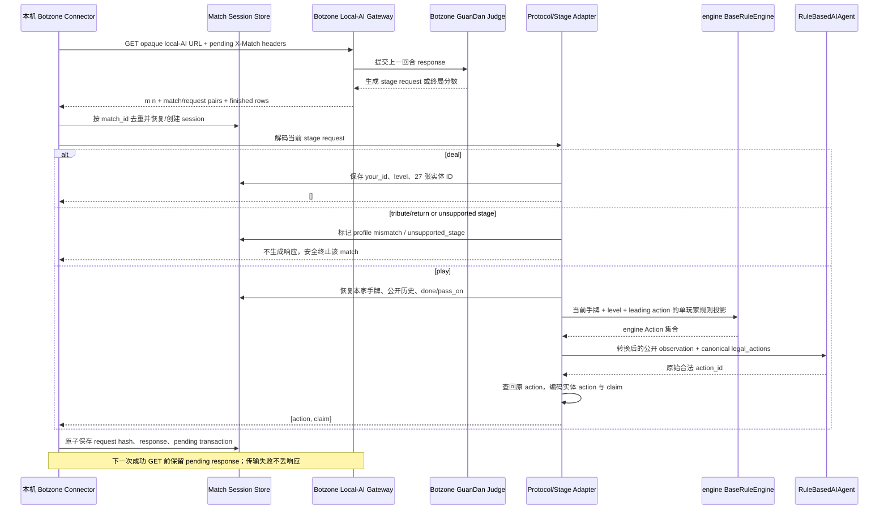

# Botzone 接入计划：本地 connector 与直接上传 Bot

## L5-A2b5：required-fields 安全画像

状态：实现与离线回归已验证，独立实现检查点待建立。

- 固定 profile：`required_requests_missing`、`required_responses_missing`、`required_both_missing_empty_object`、`required_both_missing_inner_stage_candidate`、`required_both_missing_optional_only`、`required_both_missing_other_object`。
- profile 仅在父诊断 `envelope_shape_invalid`、detail `envelope_required_fields_missing` 下产生。
- 其他 shape detail、inner/history/replay 失败与合法信封均不得产生 profile。
- connector/runner 只聚合 allowlist profile；未知值丢弃。
- audit v4 保留 v3 字段语义，只新增 `diagnostic_profiles`；不得保存请求 key/value、长度、hash、match、牌或异常正文。
- 下一阶段 L5-A2b6 只做检查点复核和零网络 preflight，不直接恢复 live。

### L5-A2b5a：实现检查点封存

由于规划任务不能提交非 docs 文件，L5-A2b5 的七个已验证改动必须先由独立实现任务精确提交。该任务只允许检查 diff、运行 36/574 回归并提交既有文件；禁止编辑、preflight、配置读取和网络操作。检查点完成前，L5-A2b6 保持阻塞。

实际结果：检查点 `8e8d639011bd095bcf0af74816609c63e8c6199f` 已建立，精确包含七个文件，36/574 回归及补丁检查通过，工作区干净。L5-A2b6 已解除阻塞，但仍只允许零网络 preflight。

### L5-A2b6：v4 零网络 preflight

唯一运行 exit 2；所有网络/模型计数为 0，state 与进程清理完成。由于入口把 runtime config、state preflight 与 DeepSeek 组合异常统一映射为配置错误，当前结果只能定位到本地组合路径。L5-A2b6 永久无效，不重跑；L5-A2b6a 将用仓库外、process-only、固定阶段 audit 继续诊断。

### L5-A2b6a：process-only 分阶段诊断

仓库外唯一诊断已完成，固定结果为 `runtime_config_invalid`：只完成 `runtime_config_load_started`，未进入 state preflight、AppConfig、agent factory 或 Agent 创建。诊断 audit 未保存异常、配置、路径或输入；state 清理完成，所有网络、模型、connector 与 suggestion 计数均为 0。该结果只限定本地 `load_runtime_config()` 边界，不能归因 URL、目录权限或其他具体原因。下一步必须单独规划 runtime-config 的更细离线诊断，不得重跑正式 preflight 或 live。

### L5-A2b6b：仓库外子阶段诊断

合成资格返回 `diagnostic_harness_invalid`，真实配置未读取，不能继续归因。后续不再增加仓库外一次性诊断脚本；L5-A2b6c 将在正式入口内部增加仅 preflight 可见的固定 allowlist 失败分类，并由离线单测封板。该实现不授权 preflight 或 live。

### L5-A2b6c：仓库内安全诊断契约

检查点 `3f2cadb7f242625ca0978c5b47a5bc6f5ed299e7` 已锁定十种 preflight-only 固定失败类别，成功与非 preflight 输出兼容。下一步 L5-A2b6d 只运行一次零网络 preflight，并显式设置 `PYTHON_DOTENV_DISABLED=1`，避免读取仓库 `.env`；该步骤仍不授权 live。

### 简化后的 runmatch 路线

根据 [官方本地 AI 文档](https://wiki.botzone.org.cn/index.php?title=%E6%9C%AC%E5%9C%B0AI) 与 [快速建桌参考文章](https://blog.csdn.net/sinat_37574187/article/details/145495160)，runmatch 通过 GET 和 `X-Game`、`X-Player-*`、可选 `X-Initdata` 创建对局，且必须恰好一个 `me`。后续不再依赖人工建桌时序：本地 preflight 可重复修复，ready 后取得三个 Bot ID、座位和授权，先启动 connector，再发送一次 runmatch。无贡 initdata 未封板，因此省略该 Header，并对非零 tribute/贡还阶段 fail-closed。

preflight 必须使用项目 `.venv\Scripts\python.exe`。该环境的 `python-dotenv` 在 `load_dotenv()` 入口先检查 `PYTHON_DOTENV_DISABLED`，命中后不会创建解析器或读取 `.env`；系统 PATH 中其他 Python 版本不作为受支持运行环境。

本地 preflight 已以该解释器通过，耗时 206 ms，所有网络/模型计数为 0。L5-A2b7 将使用三个现有 GuanDan Bot ID、唯一 `me` 和一次 runmatch GET 创建唯一对局；省略 `X-Initdata`，收到非零 tribute 或贡还阶段立即停止。

L5-A2b7 的项目所有者输入与授权已齐备：本家座位为 0，三个非本家位置复用同一个现有 Bot。官方公开说明只锁定“有且只有一个 `me`”，没有明确要求其他 Bot ID 互不相同；平台仍可能按普通建桌限制拒绝。该情况只允许记录创建失败并终止，不得替换 Bot、重试或创建第二局。具体 Bot ID 只在本次执行内存中使用，不写入文档或审计。

L5-A2b7 证明 runmatch 可创建，但 local-AI poll 的实际请求是直接 GuanDan `stage` object，不是当前 connector 强制要求的 Bot `requests/responses` 信封。唯一运行在处理请求前 fail-closed，未触达 Agent 或 DeepSeek。L5-A2b8 将在 poll/response 边界显式区分 `bot_envelope` 与 `direct_stage`：前者保留 replay 和 response wrapper，后者依赖 durable session 并发送 canonical 原始 GuanDan response；两者均不得绕过 protocol、legal action provenance 或 pending/ack 事务。

L5-A2b8 已按该设计完成：检查点 `2cd208b9b8f7306decf3182318fb55278c09d641` 保持 envelope replay 兼容，并让 direct deal/play 使用 durable session 与未包装的 canonical response。下一步先做一次零网络本地准入；只有准入 ready 且项目所有者重新明确授权后，才能以全新 state/audit 执行新的单次 runmatch smoke。

L5-A2b10 已在真实平台证明 direct-stage request/response/Header 可达，但闭环因 transport failure limit 与 unqualified raw finished 失败。官方 local-AI 是长轮询，timeout 可能只是当前无新 request；现有聚合却无法区分 timeout 与其他 transport failure。L5-A2b11 将 timeout 作为受 wall/cycle 约束的 idle 结果，并为其他失败保留固定 category；同时细分 aborted、非四人、四人未 qualified 与 qualified finished，但绝不以 raw finished 替代 play-ack qualification。

L5-A2b11 已按该设计完成并封存为 `220c648a4629453621f534beaeb95e52d85656ce`。timeout 现为独立 idle 计数，真实 transport failure 保持安全分类和失败上限；v5 audit 提供互斥 finished provenance，仍只有已 ack play 的四人 finished 能 qualified。下一步先做一次零网络组合准入，之后才重新取得 live 授权。

L5-A2b12 尚未运行 preflight：沙箱无法创建全新的系统临时 state 目录，故以 `temporary_state_directory_unavailable` 在进程启动前停止。L5-A2b12a 不改变实现或安全边界，只对创建/删除单个仓库外临时目录及运行一次零网络 preflight 请求文件权限；不得借此联网或使用仓库内 state。

L5-A2b12a 在受限提升后仍无法创建目录，说明 Codex 沙箱路径不可用，但没有形成 runtime 失败。L5-A2b12b 转为项目所有者在宿主机 PowerShell 手动创建全新仓库外目录并运行一次 `--preflight-only`；命令不启动 transport/connector，目录为空才做非递归删除，结果只回报固定状态。

L5-A2b12b 仍无法创建全新仓库外资源，故不再尝试动态目录。既有用户管理目录 `D:\VsCodeProject\BotzoneState` 已只读确认存在且为空；L5-A2b12c 仅复用它运行一次 `--preflight-only`，不创建 audit、不删除目录。若其文件操作仍失败，则问题留在宿主机权限层，不修改 connector 安全边界。

L5-A2b12c 进一步确认 state 可用性与 audit 可用性必须分开：state 目录存在且为空，但没有独立 audit 目录，因此 live 在首个 GET 前停止。L5-A2b12d 由项目所有者准备固定 `D:\VsCodeProject\BotzoneAudit`，使用 `{}` 探针验证原子写并恢复为空；该目录不能与 SessionStore 根目录合并。

L5-A2b12d 的宿主机结果为 audit exists/empty/probe=`True/True/passed`。至此固定 state 与 audit 目录均独立、存在且为空。L5-A2b12e 只复用 state 运行零网络 preflight，并复核 audit 仍为空；ready 后才重新取得 live 授权。

L5-A2b12e 已以固定宿主机目录通过零网络 preflight：单行 `preflight_ready`、exit 0、state/audit 为空、stderr 未显示。L5-A2b13 仅准备一次新的 long-poll v5 live：沿用 direct-stage、timeout idle、固定 transport category 与 qualified finished 门槛；没有项目所有者新授权不得启动。

L5-A2b13 唯一 live 未形成可审计闭环：connector 与 runmatch GET 各一次，页面未显示对局，随后 connector 被终止；completion audit 缺失，state 非空且未读取/清理。结论固定为 `botzone_deepseek_runmatch_no_tribute_smoke_invalid`。L5-A2b14 只允许在本机内存中按现有 session schema 提取低基数聚合，并用前后目录摘要证明 state 未改变；不得记录文件名、match、牌、history、response、digest 或异常正文，也不得联网或清理。

L5-A2b14 已完成，判定 `botzone_live_residual_state_audit_verified`。completion audit 仍缺失；state 只含一个可验证的 finished tombstone，未发现可归因的 active session、pending delivery、handler completion 或缓存 response。前后目录摘要一致，仓库外 audit 只保存固定聚合并通过 schema/value allowlist。该证据不说明 runmatch 是否创建、local-AI 是否收到请求、DeepSeek 是否被调用或对局处于何阶段。L5-A2b15 仅精确清理该 tombstone；后续 live 改用网页人工建桌，connector 连接后由项目所有者确认页面创建成功，不再调用 runmatch。

L5-A2b15 已精确删除唯一已审计 finished tombstone，state 为空且既有聚合 audit 不变，判定 `botzone_finished_tombstone_cleanup_verified`。L5-A2b16 不再发送 runmatch GET：唯一 connector 启动后，由项目所有者先确认本地 AI 页面显示已连接，再人工创建一个“需要进贡=否”的 GuanDan 桌并确认进入对局。只有该双重人工确认与 v5 request/response/Header/qualified-finished 证据同时成立，才可验收人工桌闭环。

L5-A2b16 在人工新桌确认前收到 4 个 request 并完成 3 个 response/Header，随后以 `history_alignment_failed` fail-closed；这些流量不能归入新桌，结论保持 invalid。当前 merge 契约假定连续 request 的四手窗口至少有一项重叠，但本地 AI 两次决策间可能完整经过四个动作，官方固定窗口因而合法地零重叠。L5-A2b17 只允许在 incoming 精确为 4 项且不存在任何 overlap 时追加完整窗口；少于 4 项的零重叠继续拒绝，并要求 direct durable session 与 Bot envelope replay 语义一致。

L5-A2b17 已按该边界封存为 `5bb44fd4052e181d08455594ab0879c0ee305dfb`：完整四项零重叠窗口追加、短窗口拒绝、最长 overlap 与 envelope/direct 等价性均通过回归，判定 `botzone_four_event_history_rotation_contract_verified`。旧 active session 不因代码修复自动失效或删除；L5-A2b18 只在项目所有者明确放弃旧会话、确认旧桌关闭，且 session 严格为 idle、无 pending/effect 时执行单文件删除。之后才重新准备人工桌 live。

L5-A2b18 已精确清除该旧 active session：删除前为合法 `play/idle` 且无 pending/effect/finished，删除后 state 为空，旧 audit 不变，判定 `botzone_abandoned_active_session_cleanup_verified`。L5-A2b19 不使用 runmatch，新增人工时序门槛：connector 启动后先等页面“已连接”，等待期间 state 必须为空；实施任务明确允许后，项目所有者才创建唯一无贡桌并确认进入对局。提前出现 state/request 视为旧流量并停止。

L5-A2b19 证明上述“确认消息前 state 必须为空”不适合人工网页流程：项目所有者已在页面进入新桌，但聊天确认稍后到达，connector 因 state=1 提前终止。该运行保持 invalid，未形成 audit。L5-A2b20 先在用户明确关闭桌面并放弃恢复后清理单一残留 session；L5-A2b21 将改用启动前 state=0、旧桌全关、只建一桌作为归属前置，connector 启动后允许用户看到页面连接即直接建桌，文字确认可随后到达。

L5-A2b20 已清理该残留 `play/inflight` session：用户明确关闭桌面并放弃 pending response 后，严格 schema/key/path 验证、脱敏 cleanup audit 和单文件删除均通过，state 为空。L5-A2b21 的人工归属不再依赖聊天到达顺序：只要求 connector 启动前 state=0/旧桌全关/单桌承诺；实施任务发出运行标记后，用户在页面连接时直接建桌，state 0→1 为预期，最终以用户单桌确认与 v5 协议聚合共同验收。

L5-A2b21 首次完成真实人工无贡桌闭环，判定 `botzone_manual_no_tribute_deepseek_mode_smoke_verified`：23/23/23 request/response/Header、qualified finished=1、零 transport failure/timeout/协议诊断，connector 正常因 `finished_target` 退出。该里程碑确认本机 `deepseek` 模式 connector 可完成 Botzone 协议闭环，但 v5 没有模型调用成功与 fallback 计数，不能证明 DeepSeek 实际参与。L5-A2b22 先清理成功局 tombstone；L5-A3a 再离线增加脱敏且守恒的模型路径聚合计数。

L5-A2b22 已完成成功局清理：唯一最小 finished tombstone 严格验证后删除，state 为空，原 v5 audit 不变；新 cleanup audit 为 405 bytes、SHA-256 `10037c02ffeca2e4967aa3925e893d4386cd9df76cd213086c8ede2260079c13`。L5-A3a 将在 integration 层离线增加模型调用结果与最终动作来源聚合，保持 agents/engine、协议和动作选择不变。

L5-A3a 已封存为 `0c51c5ff85f4edbe980dc1b5e63397da6f5747cc`，判定 `botzone_deepseek_runtime_observability_verified`。v6 以加法方式保留 v5 协议聚合，并增加 `rule_primary/local_shortcut/model/deepseek_rule_fallback/adapter_rule_fallback` 与 `success/timeout/exception/invalid_suggestion` 的严格守恒计数。L5-A3b 先完成零网络准入和固定 live 判定，再由 L5-A3c 独立授权验证是否实际观察到模型合法动作。

独立实施任务无法继承规划任务中的敏感输入，已以 `runmatch_participants_missing` 在零网络状态停止。后续采用同任务输入恢复：项目所有者必须直接在执行 live 的任务中提供三个 Bot ID 和完整授权，实施任务核对后立即执行；不得把 ID 写入 docs，也不得再通过新任务转交。

更新时间：2026-08-15

## 0. Phase 0：手动建桌无贡 profile 官方协议封板（2026-08-09）

### 0.1 唯一判定

`botzone_manual_no_tribute_phase0_verified`

此判定只针对 `Botzone GuanDan manual-table no-tribute profile` 的官方协议前置；它不改变 K-A3d3b、K-A3d3c2 或 K-A3d3c3a 的任何结论，也不表示 connector 已实现或可启动。该判定只允许进入 L1-A1 的离线协议模型、108 ID codec 和测试，不授权联网、创建桌子、加入对局或调用本地 AI。

### 0.2 仅采用的官方来源

| 来源 | 固定版本 / 核对日期 | 证据类型 | 可直接确认的范围 |
|---|---|---|---|
| [本地 AI](https://wiki.botzone.org.cn/index.php?title=%E6%9C%AC%E5%9C%B0AI&oldid=2230) | `oldid=2230`；2026-08-09 | 官方 Wiki 词条与官方 Python/C++ 样例 | GET 长轮询、`m n` 首行、`2*m` match/request 行、finished row、`X-Match-<match_id>`、多 match、`runmatch` Headers。 |
| [Bot](https://wiki.botzone.org.cn/index.php?title=Bot&oldid=2245) | `oldid=2245`；2026-08-09 | 官方 Wiki 词条 | 常规 Bot 的 JSON/simple-IO 历史语义；不能把它当作 local-AI 网关重放保证。 |
| [GuanDan](https://wiki.botzone.org.cn/index.php?title=GuanDan&oldid=2497) | `oldid=2497`；2026-08-09 | 官方 Wiki 规则、字段定义与 request/response 样例 | 108 ID、`deal`/`tribute`/`return`/`play`、`[action, claim]`、pass、近四手 history、`global` 字段。 |
| [GuanDan 游戏详情](https://www.botzone.org.cn/game/GuanDan) | 2026-08-09 | 用户从官方详情页“裁判代码”提供的源码副本 | 31,136 bytes，SHA-256 `20d06056689341e1745837564dfae325bd56e54c7b0337bc11c6e8c856bc6b46`；确认 claim 校验、双配子能力、无贡 initdata、四次 deal 后首个 play。 |
| 目标账号“本地 AI 配置”页面 | 2026-08-09 | 登录后脱敏权限截图 | **confirmed**：目标账号可见密钥、连接 URL、连接状态和提交控件，页面显示当前账号适用门槛；真实密钥/URL 已暴露后必须轮换，文档不记录其值。 |

所有 URL、版本和内容只用于文档引用；不记录本地 AI URL、连接密钥、match ID、Header 值、账号身份或个人资料。

### 0.3 confirmed / unsupported / unknown

| 项目 | 状态 | 官方依据或边界 | 对手动无贡路径的影响 |
|---|---|---|---|
| 108 ID 映射 | **confirmed** | 每副为 `0..53`；普通牌按 `h,d,s,c`，从 A、2 到 K；`52` 小王、`53` 大王；`54..107` 重复。 | 可进入后续离线 codec 设计；当前 `engine.cards` 的 `S,H,C,D` 和无副本模型不能直接当作平台 ID。 |
| `deal` | **confirmed** | `stage="deal"`，`deliver` 为本家 27 张实体 ID，`your_id` 为座位；response 是 `[]`。 | 可作为无贡 profile 的允许 stage。 |
| `play` 基础形状 | **confirmed** | response 是 `[action, claim]`；两者均为整数 ID 数组；无配子时二者相同；pass 精确为 `[[], []]`。 | 普通牌和 pass 的协议形状可封板。 |
| `play.history` | **confirmed** | 裁判固定维护四槽窗口；无贡首个 play 为 `[[],[],[],[]]`，之后以 `history[1:] + current_move` 滑动，真实项含 `player/response`。 | parser 必须规范化前缀空槽；session 仍需持久化近四手之外的公开状态。 |
| `global.level/resist`、`done`、`pass_on` | **confirmed from referee source** | 无贡 play 的 `global.resist=false`；`done` 按出完顺序追加；`pass_on` 为 `-1` 或刚出完、尚待接风处理的玩家。 | 必须 stage-specific 严格解析；adapter 按裁判的 latest-window 扫描语义重建 free/follow，不自行猜测。 |
| 配子实体 | **confirmed** | 红桃级牌是配子，可代替任意非大小王牌。 | 与本地 `carrier_cards` / `wildcard_info` 的概念可对接，但不足以编码 claim。 |
| 配子 claim 的花色、副本、排序、重复和 canonical 规则 | **confirmed with strict adapter policy** | 裁判源码 `isLegalClaim()` 按牌面多重集匹配所有非配子 action，剩余 claim 牌对应配子且不得为王；ID 经单副牌牌面投影，因此两副副本等价，顺序不参与校验。裁判未严格拒绝 claim 重复实体 ID 或越界整数。 | adapter 必须比裁判更严格：只输出 `0..107`，自然牌固定 `claim=action`，声明使用确定性 canonical ID，不依赖裁判宽松行为。 |
| 单手配子数量及多配子牌型约束 | **confirmed** | 物理牌池只有两张红桃级牌；源码允许所有红桃级牌从自然牌匹配中豁免，并明确存在“bomb with 2 coverings”路径，随后统一用 claim 做牌型判断。 | Botzone 最多允许两张配子；当前 engine 每手最多一个配子，只实现合法子集并记录能力缺口，不修改 engine。 |
| 无贡手动桌首个 `play` 先手 | **confirmed** | 源码把缺失/0 `tribute` 规范为 0，`first/last=None`；四家 deal response 完成后直接生成 `stage="play"`，`nextplayer=0`。 | adapter/session 以 Botzone 玩家 0 为无贡新桌首个先手，再映射为本地玩家 1。 |
| 无贡时严格跳过 `tribute/return` | **confirmed** | 源码在 `tribute==0` 分支直接发首个 play；只有 truthy tribute 才进入 tribute 分支。 | 无贡 profile 正常阶段为 deal→play；仍需识别意外 `tribute/return` 并 fail-closed。 |
| 贡/还/抗贡/双贡/跨局升级 | **unsupported** | 当前项目只实现单局 play；无 tribute/return/resist/升级状态模型。 | 任何此类 stage 一律 `unsupported_stage`，不调用 Agent、不伪造 pass。 |
| local-AI GET / Header / 批量 match | **confirmed** | 本地 AI词条规定 GET、首行 `m n`、request/finished 行和 `X-Match-<match_id>`；样例按每 match 维护 pending response。 | connector 只能作为后续实现；当前不实现。 |
| local-AI 重放、提交成功确认、服务端超时秒数 | **unknown** | 官方样例在 URL/HTTP error 后重试，但没有给出 exactly-once ack 或固定长轮询秒数。 | 后续 connector 需保守持久化 pending response；不得承诺重放语义。 |
| `runmatch` / `X-Initdata` 无贡表达 | **unknown — optional** | 官方只定义 `X-Initdata` 为可选初始化数据，未给 GuanDan 无贡值。 | 仅阻塞自动建桌；不阻塞手动建桌的 Phase 1–3。 |
| 目标账号可用本地 AI | **confirmed** | 登录后页面显示本地 AI 配置入口、提交按钮和连接状态。 | 不再阻塞离线实现；真实 smoke 前必须轮换已暴露密钥并重新取得联网授权。 |

### 0.4 action / claim 与当前 engine 的封板

已确认的无歧义部分：

- `Action.make_pass()` 必须编码为 `[[], []]`；
- 无配子的 canonical action 只能把同一组**真实实体 ID**同时填入 action 与 claim；
- action 是真实 carrier，claim 是配子替代后的声明；两副相同牌必须在 session inventory 中保留原 ID，不能仅按 token 扣牌；
- 当前 `Action.carrier_cards`、`Action.declared_cards` 和 `WildcardInfo` 是 adapter 输入候选，而不是 Botzone 输出真值。

官方源码确认的 claim 行为：

- action 与 claim 必须等长；所有非红桃级牌按花色+点数多重集出现在 claim 中；
- 剩余 claim 项与配子一一对应，不能声明为大小王；同花顺等牌型由 claim 的声明花色参与判断；
- 两副相同牌在 claim 中等价，顺序不参与裁判语义；自然牌仍采用更严格、稳定的 `claim=action`；
- 两张红桃级牌可以同时作为配子，最终声明统一进入牌型识别；
- 裁判对 claim ID 范围和重复实体 ID 的检查较宽松，integration 必须自行限制 `0..107` 并生成确定性 canonical 声明。

上述证据允许 L1-A1 实现离线 codec/protocol；play adapter 仍属于 Phase 3，必须经过 Phase 1/2 测试后才能实现。

### 0.5 无贡手动桌与 transport 的操作边界

用户侧手动操作的唯一目标 profile 为“建桌时选择需要进贡=否”。官方裁判源码确认四家依次完成 `deal` 后直接向 Botzone 玩家 0 发出首个 `play`。未来 dispatcher 只允许该 profile 的 `deal/play`，遇到 `tribute`、`return` 或未知 stage 必须停在 `unsupported_stage`。

本地 AI 官方词条确认：手动创建或加入桌后可选择“用本地AI替代我”；local-AI 是本机向 opaque URL 发起 GET 的长轮询，不是本机开放端口。一次 GET 可以包含多个 match，finished row 的玩家数为 `0` 表示异常结束。真实 URL、Header 值和 response 内容均不进入文档、日志或测试 fixture。

## 1. 任务目标与可行性结论

任务编号：Step L（Botzone 本地 AI 接入）。

目标是在不改变现有 AI 边界的前提下，让本机连接器通过 Botzone 本地 AI 接口参与 GuanDan 测试对局，用真实平台对手验证 RuleBasedAI 或其他本地策略的合法性、稳定性和实际对抗表现。

第 0 节的 `botzone_manual_no_tribute_phase0_verified` 是当前唯一 Phase 0 判定；它只允许进入离线 Phase 1，不构成 connector、adapter 或真实桌授权。

- 本地 AI 传输层可行性高：官方协议是由本机发起的重复长轮询 GET，不需要公开本机端口，也不是上传源码或 WebSocket。
- claim、双配子和无贡阶段流已由官方裁判源码封板；下一步先实现离线协议模型和 codec，不跨越到 connector/adapter。
- 用户提供的建桌设置截图确认“需要进贡”可选择“否”，且默认测试对局采用该配置；因此首期真实 smoke 的支持范围可以收敛为 `deal + play`。
- 当前 engine 没有贡还能力不再阻塞无贡模式接入；但 adapter 必须识别 `tribute / return` 并以 `unsupported_stage` fail-closed，不能返回空响应、pass 或任意牌绕过。
- Botzone 允许最多两张配子，而当前 engine 每手最多一个配子；首期 adapter 只能声明支持当前 engine 可生成的合法子集。
- 首期使用网页手动建桌并明确选择“需要进贡=否”；`runmatch X-Initdata` 只属于后续自动化能力，其未知状态不再阻塞 Phase 1–3 或手动 smoke。
- RuleBasedAI 可作为第一阶段默认 AI，但它只保证从合法动作中稳定选择，不代表已有强对抗能力。真实 smoke 只能证明接入正确；实力判断需要座位平衡和固定对手的小批量统计。

本任务不得改变以下边界：

- `engine/` 继续提供出牌规则真值；
- `agents/` 只接收转换后的公开 observation 和 canonical `legal_actions`，只返回原始合法 `action_id`；
- adapter 查找该 `action_id` 对应的原始 action 后再编码 Botzone response；
- Agent 不得生成 Botzone 牌 ID、`action` 或 `claim`；
- 真实连接 URL 和密钥仅作为不透明的环境变量或启动参数传入，不写入源码、测试、文档示例或日志；
- 第一阶段默认使用 `RuleBasedAIAgent`，不使用 DeepSeek。
- 支持范围固定标记为 `Botzone GuanDan no-tribute profile`；贡还模式和跨局升级均为非目标。

## 2. 已核实的官方协议

以下事实来自 Botzone 官方页面，核对日期为 2026-08-05：

- [本地AI词条](https://wiki.botzone.org.cn/index.php?title=%E6%9C%AC%E5%9C%B0AI)，固定版本 `oldid=2230`；
- [Bot 交互词条](https://wiki.botzone.org.cn/index.php?title=Bot)，固定版本 `oldid=2245`；
- [GuanDan 词条](https://wiki.botzone.org.cn/index.php?title=GuanDan)，固定版本 `oldid=2497`；
- [GuanDan 游戏详情](https://www.botzone.org.cn/game/GuanDan)。

### 2.1 本地 AI 传输

1. 用户手动创建/加入游戏桌并勾选“用本地AI替代我”，或调用官方 `runmatch` API。
2. 本机连接器向账号页面生成的本地 AI URL 发起 GET；该 URL 包含敏感身份和密钥，程序必须整体当作 opaque secret。
3. GET 可能阻塞到有新 request 或服务端超时，属于长轮询，不是长连接流或 WebSocket。
4. 返回文本首行为 `m n`：有新 request 的对局数和已结束对局数。
5. 后续 `2*m` 行按“match ID、该回合 request”成对出现；再后续 `n` 行是结束信息。
6. 连接器把已完成 response 放入下一次 GET 的 `X-Match-<match_id>` Header。
7. 一次轮询可同时承载多个 match，必须按 match ID 隔离状态。
8. 结束行包含 match ID、本地 AI 座位、玩家数和各玩家分数；玩家数为 0 表示对局异常终止。
9. 官方未规定固定的服务端长轮询秒数；样例只在 URL/HTTP 错误或超时后等待并重试。

`runmatch` 官方 Header 为 `X-Game`、`X-Player-0..n` 和可选 `X-Initdata`。参与者必须有且只有一个 `me`；其他位置填写 Botzone 已有 Bot ID。创建成功返回 match ID。

### 2.2 Bot 通用交互与本地 AI 的实测关系

- Bot JSON 输入以 `requests/responses` 保存该 Bot 的交互历史，并可携带 `data/globaldata/time_limit/memory_limit`。
- GuanDan Wiki 展示的是数组内的单回合游戏 request，不是网关最外层 JSON。
- 人工本地 AI smoke 已确认网关实际转发完整 `requests/responses` 外层；首条 deal 和当前 play 同时出现在一次请求中，可用于冷启动重放。
- 实测请求未携带 `data/globaldata/time_limit/memory_limit`，因此这些官方字段必须可选，不能作为本地 AI 请求的必需字段。
- durable session 仍负责 match 事务、pending response、ack 和幂等；外层历史负责恢复本家牌与公开交互，两者不能互相替代。

### 2.3 GuanDan 阶段与数据

- 牌 ID 为 `0..107`。`0..53` 是第一副牌，`54..107` 重复同一牌面。
- 每副牌中普通牌按 `h, d, s, c` 排列；`0..3` 为四种花色的 A，`4..7` 为四种花色的 2，依次到 K；`52/53` 为小王/大王。
- `deal`：request 含 `deliver` 27 张牌和 `your_id`；response 是空数组。
- `tribute`：需要进贡；response 是贡牌 ID 数组。
- `return`：需要还贡；response 是还牌 ID 数组。
- `play`：response 为 `[action, claim]`。`action` 是真实打出的 ID；`claim` 是配子替代后的声明牌型。没有配子时二者相同；pass 为两个空数组。
- `play.history` 只包含近四手、包括 pass；每项含 `player` 和同结构 response。
- `done` 标记已出完玩家；`pass_on` 表示接风上下文。
- `global` 总是提供 `level`，并可能提供 `tribute`、上一局 `first/last`、`resist`、`tribute_cards`、`return_cards`。
- 用户提供的当前建桌 UI 显示“需要进贡”可选“否”；本项目只支持该无贡配置。该截图用于确认项目配置范围，不替代官方协议或裁判语义文档。
- 平台协议仍可能出现 `tribute / return`；在本项目无贡 profile 中出现这些 stage 代表建桌配置或协议状态不符合支持范围，必须安全终止该 match。

## 3. 协议与规则差异表

| 维度 | 当前项目 | Botzone GuanDan | 处理位置 / 结论 |
|---|---|---|---|
| 玩家编号 | `1..4`，1/3 与 2/4 组队 | `0..3`，0/2 与 1/3 组队 | adapter 固定 `botzone_id + 1`，测试座位和队伍保持 |
| 牌面编码 | `Card(rank, suit)` / token；无副本 ID | `0..107`，两副牌 ID 不同 | `cards.py` 保留 ID inventory；token 仅给 engine/Agent |
| 花色顺序 | token 使用 `S/H/C/D` | ID 余数顺序 `h/d/s/c` | 明确映射，不依赖枚举顺序 |
| 点数顺序 | token `A,2..K,SJ,BJ` | 每副牌普通 ID 从 A、2 到 K，再 joker/Joker | 公式+108 张穷举测试 |
| 发牌 | `reset()` 自己洗牌并给四家 27 张 | `deal.deliver` 只给本家 27 张 | 不调用随机 reset；session 接受平台发牌 |
| 副本身份 | 两张同花同点不可区分 | 两张同牌有不同 ID | 输出前按当前 ID multiset 决定实体 ID，不能只反向 token |
| 局前阶段 | 无 | 建桌可选择是否进贡；协议定义 `tribute / return / resist / double tribute` | 仅支持“需要进贡=否”；识别其他 stage 后 `unsupported_stage`，不实现策略 |
| 开局领牌者 | 构造参数 `starting_player_id` | 官方裁判无贡分支在四次 deal 后选择玩家 0 | adapter 映射为本地玩家 1；非无贡 profile 不适用 |
| 出牌历史 | engine 保存完整 history | request 只给近四手 | session 去重累计公开事件；不能只看单次 request 做全局统计 |
| 完赛/接风 | engine 内部推进并公开 finish order | `done`、`pass_on` | adapter 转为公开 observation；过渡需去重 |
| 合法动作 | `BaseRuleEngine` 输出 `Action`，`GuanDanGame` 分配 `action_id` | 平台要求 ID 数组 | integration 构造单玩家 `GameState` 投影并序列化 canonical actions |
| pass | canonical pass action | `[[], []]` | action adapter 固定转换 |
| 普通出牌 | `carrier_cards` 与 `declared_cards` | `action` 与 `claim` 相同 | 用 inventory 中实际 ID 同时填两边 |
| 配子出牌 | carrier 与 declared 分离，`wildcard_info` 显式 | `action` 与 `claim` 等长；非配子牌面守恒，剩余声明非王 | 只从被选 canonical action 转换；输出严格 canonical ID |
| 配子数量 | 当前实现每手最多 1 张 | 两副牌最多两张红桃级牌，裁判允许两张同时替代 | 当前 engine 仅覆盖合法子集；不为接入修改 engine |
| 牌型/比较 | 当前 SPEC 的单局规则 | Wiki 规则文字相近，但未完整给出所有 judge 比较细节 | Phase 0 建立官方差异 fixture；不以名称相同视为等价 |
| 终局结果 | engine 自己计算 winner/draw | gateway 结束行给各玩家 score | 以平台结束结果为审计真值；本地结果只用于测试 |
| 跨局升级 | 不支持 | 建桌可显式设置双方等级和上一轮名次 | 只消费当前测试桌给出的本局公开配置；不实现升级赛或贡还 |

## 4. 推荐目录与模块职责

建议使用 `integrations/botzone/`，不在 `engine/`、`agents/` 或现有 `cli/` 中加入连接逻辑：

```text
integrations/
  botzone/
    __init__.py
    models.py
    cards.py
    protocol.py
    session.py
    profile.py
    play_adapter.py
    runner.py
    connector.py
    __main__.py
```

| 模块 | 职责 | 禁止事项 |
|---|---|---|
| `models.py` | frozen/slots 的 poll、match result、stage request、pending response 数据模型 | 不读环境、不联网 |
| `cards.py` | 108 ID 双向映射、ID inventory、确定性实体牌选择 | 不丢副本 ID，不做策略 |
| `protocol.py` | 解析 `m/n` 文本、编码/校验 `X-Match-*`、解析 GuanDan stage JSON | 不调用 Agent，不重试网络 |
| `session.py` | match ID 隔离、事件去重、手牌/人数/完成状态、pending response 和持久化恢复 | 不保存 URL/密钥，不依赖单例全局状态 |
| `profile.py` | 验证无贡配置；允许 `deal/play`，识别并拒绝 `tribute/return` | 不实现贡还策略，不用空响应或随意动作绕过 |
| `play_adapter.py` | Botzone 公共请求→engine 规则投影→observation/legal actions；action ID→`[action, claim]` | 不让 Agent 看 Botzone ID，不调用 engine 私有状态 |
| `runner.py` | 按 stage 调度；play 默认调用 `RuleBasedAIAgent`；统一 fail-closed | DeepSeek 不作为默认值 |
| `connector.py` | 可注入 transport 的长轮询、超时/退避、批量 Header、完成通知和脱敏日志 | 不输出完整 URL/Header/response |
| `__main__.py` | 独立启动入口 | 不修改现有 `cli/run_4ai_debug.py` |

第一版优先使用标准库 HTTP 客户端，不新增依赖。连接配置模块不得导入会自动读取仓库 `.env` 的配置路径；只从显式环境变量或启动参数取得 opaque URL。环境变量名称可以文档化，但不得给出真实或可用示例值。

## 5. 完整消息流


```mermaid
sequenceDiagram
    participant Local as 本机 Botzone Connector
    participant Store as Match Session Store
    participant Gateway as Botzone Local-AI Gateway
    participant Judge as Botzone GuanDan Judge
    participant Adapter as Protocol/Stage Adapter
    participant Rules as engine BaseRuleEngine
    participant AI as RuleBasedAIAgent

    Local->>Gateway: GET opaque local-AI URL + pending X-Match headers
    Gateway->>Judge: 提交上一回合 response
    Judge-->>Gateway: 生成 stage request 或终局分数
    Gateway-->>Local: m n + match/request pairs + finished rows
    Local->>Store: 按 match_id 去重并恢复/创建 session
    Local->>Adapter: 解码当前 stage request
    alt deal
        Adapter->>Store: 保存 your_id、level、27 张实体 ID
        Adapter-->>Local: []
    else tribute/return or unsupported stage
        Adapter->>Store: 标记 profile mismatch / unsupported_stage
        Adapter-->>Local: 不生成响应，安全终止该 match
    else play
        Adapter->>Store: 恢复本家手牌、公开历史、done/pass_on
        Adapter->>Rules: 当前手牌 + level + leading action 的单玩家规则投影
        Rules-->>Adapter: engine Action 集合
        Adapter->>AI: 转换后的公开 observation + canonical legal_actions
        AI-->>Adapter: 原始合法 action_id
        Adapter->>Adapter: 查回原 action，编码实体 action 与 claim
        Adapter-->>Local: [action, claim]
    end
    Local->>Store: 原子保存 request hash、response、pending transaction
    Note over Local,Gateway: 下一次成功 GET 前保留 pending response；传输失败不丢响应
```

关键边界：Botzone Gateway 只与 connector 通信；Agent 不直接接触网络、match ID、Botzone 牌 ID、连接 URL 或 Header。

## 6. 状态、持久化与重连

### 6.1 会话状态

每个 match ID 独立保存：

- 协议版本和 stage；
- `your_id`、level、已确认的无贡 profile 和必要公开本局配置；
- 初始和当前本家 Botzone ID multiset；
- 去重后的公开 play 事件、各玩家剩余张数、done 顺序和 pass_on；
- 最新 request digest、已生成 response、pending/acknowledged 状态；
- 不含密钥的诊断计数。

### 6.2 持久化策略

- 内存 map 只作工作集，不能作为唯一真值。
- 每次生成 response 前后使用原子 snapshot 或 append-only journal，目录位于显式 runtime state dir，不放在仓库 `logs/`。
- snapshot 不保存本地 AI URL、密钥、完整 HTTP Header 或环境变量。
- 相同 request digest 必须返回完全相同 response，避免重试导致策略随机漂移。
- 只有携带 pending Header 的 GET 成功返回后，才把该 pending transaction 标为已发送；传输异常时保留并重发同一 response。
- 收到 finished row 后归档最小聚合结果并删除活动手牌状态。
- 启动时若收到非 `deal` request 且本地无可恢复 session，整体 fail-closed，不猜手牌、不伪造 pass；收到 `tribute/return` 同样 fail-closed。

### 6.3 历史恢复边界

Botzone 的内层 `play.history` 仍只有近四手，但真实本地 AI 请求已确认使用标准 Bot JSON 交互信封：顶层 `requests/responses` 重放本 Bot 的完整请求/响应历史。adapter 应从首条 `deal` 和全部既往本家 response 重建当前实体手牌，再用各 `play.history` 合并公开动作。durable session 继续负责 match 隔离、pending response、ack 与幂等，但不再作为冷启动恢复本家手牌的唯一来源。

## 7. 分阶段实施计划

### Phase 0：官方协议核实与差异清单

状态：已完成。官方裁判源码、官方 Wiki 与目标账号脱敏配置页证据已封板，唯一判定为 `botzone_manual_no_tribute_phase0_verified`。后续 L1-A1 与 L2-A1 均已完成；runmatch 自动建桌仍是可选后续能力。

工作：

- 保存官方页面固定版本、核对本地 AI poll/Header/runmatch 协议；
- 从官方 GuanDan 裁判源码或脱敏真实调试 Log 确认 claim、配子数量和无贡模式的 request 顺序；
- 把“需要进贡=否”定义为唯一支持的 Botzone profile，并确认手动建桌可以稳定选择该配置；
- 核实 `runmatch` 的 `X-Initdata` 如何无歧义表达“需要进贡=否”；未确认前不使用 runmatch，但不阻塞手动建桌路径；
- 在登录后的账号设置页确认当前部署的本地 AI 等级门槛；
- 建立不含真实 URL、密钥、match ID 或手牌的协议差异表和脱敏 fixture 清单。

验收：

- 所有字段标为 confirmed/unsupported/unknown，不以第三方实现补官方空白；
- `deal/play` 的字段与顺序有官方依据；`tribute/return` 能被精确识别并返回统一 unsupported 诊断；
- claim 编码可无歧义映射当前 canonical action；
- 确认账号权限和手动桌选择方式；runmatch 前置可保持独立 unknown；
- 未读取或持久化任何真实密钥。

以上条件已满足，L1-A1、L2-A1 与 L2-A1a 已完成；当前必须先完成 L2-A1b 官方请求契约补全，不得跳过 Phase 3 直接真实连接。

### Phase 1：纯协议模型与卡牌映射

状态：已完成，唯一判定 `botzone_no_tribute_protocol_verified`。定向 14 项、全量 460 项通过；实现已形成独立检查点 `db8f351f2b416a67ab13ae35de6923aefa2ae859`。

工作：已实现 `models.py/cards.py/protocol.py` 和三份离线测试；不联网、不调用 Agent。

验收：

- 108 个 ID 全量双向映射；两副同牌 round-trip 后仍保留原 ID；
- `deal/play` request/response 严格编解码；`tribute/return` 至少严格解析 stage 标识并以 unsupported 结果拒绝；
- deal/play/pass、claim、多配子、无贡 opening 和 unsupported stage 已有测试；
- poll 的多 request、finished、CRLF/LF 与 Header 注入明确转入 Phase 2；
- 不读取配置、环境变量或 `.env`。

### Phase 2：连接器骨架与 mock Botzone

状态：L2-A1 已提交为 `3b1b75ba1811f629f91718e5997ec9955c524b73`。L2-A1a 定向 34 项、全量 480 项通过，历史判定 `botzone_phase3_admission_contract_verified`；其六个修改文件尚未形成独立检查点。官方首个 play 精确复核后，Phase 3 前还需执行 L2-A1b。

工作：实现 poll 文本模型、可注入 fake transport、session store 和 pending response 事务；只连 mock transport。本阶段不提供真实 HTTP transport或 live module 启动入口。

验收：

- mock 覆盖阻塞 poll、超时、HTTP 错误、重试、多 match 和 finished；
- 失败重试不丢失或改变 pending response；
- 重复 request 幂等；多会话手牌/历史完全隔离；
- 进程重启后从临时 state dir 恢复；无状态中途 request fail-closed；
- 日志和异常不含 URL、密钥或完整 Header。
- 通过后唯一判定 `botzone_mock_connector_verified`；仍不得声称 connector 可连接真实 Botzone。

Phase 3 准入审计新增硬门槛：

- claim 对虚拟声明 ID 必须允许官方裁判接受的重复，覆盖 9/10 张配子炸弹；action/known hand 仍保持实体唯一；
- handler 必须接收按 match 隔离的不可变 session context，不能只收到无手牌的 `PlayRequest`；
- pending response 必须携带 action 实体 ID effect，只在 transport 成功 acknowledge 后原子扣牌一次；
- latest four history 必须可验证地并入累计公开事件；无法对齐时 fail-closed。

L2-A1b 已通过 `botzone_phase3_official_request_contract_verified`。L3-A1 随后完成离线 RuleBased adapter，检查点为 `39bd881f7155a35a49f989910be7dcd8bd23e02a`。L3-A1a 已封板精确 observation 与实体守恒，检查点为 `253159f7cf00e9995cc986bac816bf67a8596a4e`，判定 `botzone_adapter_observation_hardening_verified`。L4-A1 离线 HTTP connector/runner 也已完成，当前不直接 live。

### Phase 3：连接 RuleBasedAI 的端到端回合测试

状态：L3-A1 主链与 L3-A1a 加固均已完成；公开 observation、外部 wildcard table action、实体守恒和 context 一致性已封板。

工作：实现 `profile.py/play_adapter.py` 和可注入现有 mock connector 的 RuleBased handler，完成无贡 profile 的 `deal + play` 链路；不提供 CLI/module runner，不联网、不实现贡还路径。

验收：

- adapter 只用公开 request/session 生成 observation 和 legal actions；
- `RuleBasedAIAgent` 返回值经 `require_legal_action_id` 和原始 action 映射双重验证；
- pass、自然出牌、配子 action/claim、接风和玩家完成均通过；
- 每个输出都可追溯到原始 legal action，未知输入不伪造动作；
- 单玩家规则投影与 `GuanDanGame.legal_actions()` 在可构造同状态 fixture 上等价；
- deal→多轮 play 的脱敏端到端脚本完成；
- 任一 `tribute/return` 输入都不调用 Agent、不生成动作，并稳定返回 `unsupported_stage`；
- 通过后只能标记 `botzone_no_tribute_adapter_verified`，不得标记完整 Botzone GuanDan 支持。

L3-A1a 验收补充：

- current/history round 来自同一次累计公开历史重放；同轮连续跟牌不新开 round；
- table action 使用 `action_id=None`，history 只含公开六字段，本家手牌稳定排序；
- 外部自然牌及一/双配子动作重建 canonical declared cards、wildcard info 与稳定 display；
- 实体 action ID 全局唯一，本家 27 张与公开出牌守恒，done/未完成容量边界 fail-closed；
- global/window/history/local/finished 矛盾在 Agent 创建前拒绝；
- 判定 `botzone_adapter_observation_hardening_verified` 不代表存在可用 live connector。

### Phase 4 准备：离线 HTTP connector 与 runner

状态：离线 HTTP connector 与 runner 已完成。L4-A3a 已完成外层 Bot JSON 信封、首条 `deal`/既往 `play` response 重放、无贡空 `tribute_cards`/`return_cards` 校验，以及 Header 前的 canonical `{"response": ...}` 包装；仅合成 fixture 验证，尚未恢复 live 资格。L4-A2c5b2a 文件系统矩阵继续暂缓。

工作：

- 使用标准库实现可注入 opener 的 HTTPS GET transport；
- 仅从显式启动参数或进程环境读取敏感 URL 与 state dir，不加载 `.env`；
- 组合现有 session、connector 与 `NoTributeRuleBasedHandler`，提供前台 module runner；
- 在 fake gateway 下验证批量 Header、pending resend/ack、重启、退避和退出；
- 默认 Agent 保持 RuleBasedAI，不自动建桌、不使用 runmatch、不联网。

验收：

- URL、Header、match ID、请求/响应正文和手牌不进入日志、异常、snapshot 或测试 fixture；
- 只允许 HTTPS，拒绝重定向、Header 注入、无限响应和无限等待；
- 单次 transport 不重试，runner 采用有上限退避，成功后重置；
- fake gateway 的 `deal → play → failure → restart → resend → ack` 保持 response/effect 幂等；
- 配置错误、transport 错误、Ctrl+C 和 unsupported stage 有稳定退出行为；
- 全程无 socket/真实网络；通过后唯一判定 `botzone_local_connector_offline_verified`。

L4-A1 已实现：

- 标准库 HTTPS GET、注入式 opener、无 body、响应大小限制、重定向拒绝和脱敏错误；
- 仅显式参数或 `BOTZONE_LOCAL_AI_URL` / `BOTZONE_STATE_DIR` 的 runtime 配置；
- 前台循环、确定性退避、failure limit、有限 cycle、Ctrl+C 与 module 入口；
- fake gateway 的 pending failure/restart/resend/ack 与多 match 回归；
- 未读取 `.env`、未联网、未调用 DeepSeek。

L4-A1a 已通过的 live 准入硬门槛：

- runner 按 `stop_after_finished`、wall time、cycle、failure 与 fatal diagnostic 有界停止；
- 非 transport diagnostic、尤其 `unsupported_stage`，立即 fail-closed；
- finished 后活动 session 删除或降为不含 match ID、手牌、history、response/digest 的最小 tombstone；
- response 全路径关闭，Header 名为严格 ASCII token；
- stable exit code 和最小聚合 audit，不输出 URL、state dir、match ID、Header 或正文；
- `preflight-only` 验证仓库外绝对 state dir 与配置，但零 opener/零网络；
- 通过后唯一判定 `botzone_live_smoke_preflight_ready`，仍不得自动联网。

L4-A2a 只读前置审计已完成：

- 先把 L4-A1a 十个 runtime/session/test 文件独立封存并保持工作区干净；
- 用户明确确认截图中暴露过的 Botzone 连接凭据已轮换；不得读取或比较 URL 来代替确认；
- 只检查 `BOTZONE_LOCAL_AI_URL` / `BOTZONE_STATE_DIR` 在当前进程中存在，不输出值、host、path、长度或 hash；
- state dir 与 audit dir 为仓库外全新目录；运行一次 `--preflight-only` 后仍为空；
- 不启动 connector、不发送 probe、不创建对局；
- 判定 `botzone_live_smoke_authorization_ready`；用户已明确授权固定预算的一次 L4-A2b live run。

L4-A2b 启动门槛修正：

- 实现基线固定为 `029b8d6034e55c70b83d2b1c8d4b052626895bd2`，要求它是执行时 HEAD 的祖先，不要求精确 HEAD 相等；
- 实现检查点之后只允许五份规划文档变化：`docs/BOTZONE_INTEGRATION_PLAN.md`、`docs/NEXT_PROMPT.md`、`docs/PLAN.md`、`docs/PROJECT_STATUS.md`、`docs/TESTS.md`；
- 发现代码、测试、配置或其他路径变化时 fail-closed；
- 先前 `checkpoint_head_mismatch` 未启动 connector、未发送 GET，属于前置误判，不消耗授权或 live run 次数。

### Phase 4：真实 Botzone 小规模 smoke test

结果：历史 L4-A2b 仍保持 `botzone_no_tribute_local_ai_smoke_invalid`。后续人工前台运行已建立真实 GET 长轮询连接，但进入无贡测试桌后的第一条消息以 `malformed_request` 退出；平台超时是未返回 response 的结果，不是 AI 推理超时。L4-A3a 已离线修复该外层 Bot JSON 信封缺口，但不能追认该次运行或记为 smoke 通过。

工作：

1. 使用锁定预算启动前台 connector：RuleBasedAI、100 cycles、600 秒、30 秒 timeout、连续失败 5、finished 1 局即停；再手动创建测试桌，明确把“需要进贡”设为“否”，只验证一局 deal 到终局；
2. 只有在官方资料确认 `X-Initdata` 的无贡表达后，才用 runmatch 与三个指定现有 Bot 创建至多四局，并让 `me` 轮换四个座位；
3. smoke 通过后，可另行预注册固定对手的小批量观察性对抗评测。

验收：

- 无非法 response、超时、断线丢状态或跨局污染；
- 实际只出现已支持的 deal/play；若出现 tribute/return，则该局按配置错误失败，不计为接入成功；
- 保存聚合的完成数、异常数、座位、平台 score 和耗时，不保存请求正文、手牌、match URL 或密钥；
- smoke 只证明接入可用，不声明胜率提升；实力结论至少需要座位平衡、固定对手和预注册局数。
- 第一局 smoke 必须使用仓库外全新 state/audit 目录；结束后只保留脱敏聚合 audit，活动 session 中不得残留手牌或 match ID。

### Phase 5：可选 DeepSeek

前置：RuleBasedAI 的 Phase 4 完整通过，且另行取得 DeepSeek 与 Botzone 两个外部网络面的明确授权。

验收：

- 默认仍为 RuleBasedAI，DeepSeek 必须显式开启；
- Botzone 每回合时限、模型超时和 fallback 预算有硬上限；
- 模型失败仍只能回退到原始 legal actions；
- 不把 DeepSeek API key 与 Botzone URL/密钥写入同一日志或审计文件；
- 不作为 Botzone 基础接入验收条件。

## 8. 计划新增的测试

| 测试文件 | 主要场景 |
|---|---|
| `tests/test_botzone_cards.py` | 108 ID 全覆盖、A/2/K/王边界、花色、两副副本、非法 ID |
| `tests/test_botzone_protocol.py` | poll `m/n`、多局、finished/aborted、stage JSON、Header 注入、malformed fail-closed |
| `tests/test_botzone_profile.py` | 无贡 profile、deal/play 允许、tribute/return 明确 unsupported、未知 stage 拒绝 |
| `tests/test_botzone_session.py` | request 去重、手牌 ID inventory、history 累积、多局隔离、snapshot/restart、无状态中途恢复失败 |
| `tests/test_botzone_play_adapter.py` | 0/1-based 座位、公开 observation、table constraint、pass、自然牌、配子 carrier/claim |
| `tests/test_botzone_action_provenance.py` | 所有输出来自原始 legal action ID；非法/过期/其他会话 action ID 拒绝 |
| `tests/test_botzone_adapter_observation.py` | 轮次重放、精确公开 key、外部 wildcard table action、实体守恒与 context 一致性 |
| `tests/test_botzone_connector.py` | mock GET、阻塞/超时/断线、pending 重发、批量 Header、敏感信息脱敏 |
| `tests/test_botzone_rule_agent_e2e.py` | RuleBasedAI 的 deal→关键 play 回合、终局和无贡 profile 边界 |
| `tests/test_botzone_http_transport.py` | GET/Header、timeout、重定向、响应上限、response close、严格 ASCII Header、错误脱敏与 fake opener |
| `tests/test_botzone_runtime_config.py` | 只读显式环境/参数、缺失配置、仓库外绝对 state dir、preflight-only、未导入 dotenv/根 config |
| `tests/test_botzone_runner.py` | 依赖装配、退避/重置、finished/wall/cycle/failure/diagnostic 停止、退出码与零真实网络 |
| `tests/test_botzone_live_preflight.py` | finished 敏感状态清理、最小 audit schema、fake 一局 smoke 守恒与零 opener |
| `tests/test_botzone_rule_compatibility.py` | 官方裁判/Log 脱敏 fixture 与当前 engine 的牌型、比较、配子、接风差异 |

测试 fixture 建议放在 `tests/fixtures/botzone/`，只保留官方文档样例和人工脱敏结构。不得提交真实 URL、密钥、match ID、完整真实手牌或对局 Log。

## 9. 风险与阻塞项

### Phase 0 已解除项

1. claim 的牌面多重集、副本等价、顺序和非王替代规则已由官方裁判源码确认；adapter 采用更严格 canonical 输出。
2. Botzone 最多两张配子已确认；当前 engine 一张上限保留为明确能力差异。
3. 无贡 `deal×4 → player 0 play` 与严格跳过 tribute/return 已确认。
4. 目标账号本地 AI 配置入口已确认；截图中暴露的密钥/URL 必须轮换。
5. runmatch initdata 仍不属于首期手动路径，后续自动化前再单独封板。

### P1 风险

1. 本地 AI Wiki 固定版本较旧，接口声明可能变化；Phase 4 前必须重新核对当前页面。
2. 本地 AI 网关没有明确 exactly-once ack；pending response 需要按官方样例的“失败保留、成功后提交”事务处理。
3. `play.history` 只有近四手，进程重启恢复必须依赖本地 durable state。
4. 当前 RuleBasedAI 很弱，合法完成对局不等于实际对抗能力好。
5. Botzone 平台对手与发牌不可固定，少量结果不能与本地固定 seed 评测直接比较。
6. 当前项目与 Botzone 的牌型比较细节尚未经过 judge fixture 差分，名字相同不代表完全等价。
7. 人工建桌误选“需要进贡=是”会进入本项目明确不支持的阶段；必须在启动审计和 stage dispatcher 两处 fail-closed。

## 10. play 子集的前置状态

Phase 0 至 L4-A3b1 均已完成并封存；既有 invalid/inconclusive 结论全部保留。L4-A3b1 已独立锁定 `preflight_ready` 的单行输出、空 stderr、零 transport 与临时 state 清理，唯一判定 `botzone_live_smoke_recovery_authorization_ready`。用户随后已对固定预算 L4-A3c 明确回复“授权”；执行任务仍须核对该用户消息，不能只依赖文档转述。L4-A2c5b2a 暂缓。

理由：

- 108 ID、官方首个 play、四槽 history、座位、claim、pending effect 与 `tribute/return` fail-closed 边界已有测试契约；
- 外层 Bot JSON 需要 `requests/responses` 完整历史重放，不能把整个顶层对象直接传给 inner-stage parser，也不能只取最后一条请求；
- 标准 Bot 输出的 `{"response": ...}` wrapper 已在 Header 前统一编码并通过 mock 回归；
- 当前只把 engine 已支持的单配子动作视为合法子集，双配子仍是明确能力缺口；
- 贡还属于当前 engine 明确 unsupported 的能力，即使未来无贡 profile 通过，也必须对 `tribute/return` fail-closed；
- 无贡 profile 只有取得该配置的官方证据后才是支持契约，不能由随机对局恰好未发生贡还来替代。
- HTTP URL 路径包含连接密钥，L4-A1 必须先证明异常、日志和持久化不泄露它，才允许申请 live 授权。
- finished session 已降为最小 tombstone；后续 live 仍必须扫描 state/audit，确认没有敏感内容残留。

因此里程碑命名必须区分：

- `botzone_no_tribute_protocol_verified`：证明无贡协议、牌 ID 与 unsupported stage 边界；
- `botzone_no_tribute_adapter_verified`：证明 deal + play 接入 RuleBasedAI；
- `botzone_no_tribute_local_ai_smoke_verified`：证明真实平台无贡小规模对局完成。

任何上述状态都不得简写为“完整支持 Botzone GuanDan”。

## 11. 尚不确定的信息与官方查阅位置

| 不确定项 | 当前状态 | 必须查阅的位置 |
|---|---|---|
| claim 中替代牌的花色、副本 ID 和排序要求 | 已由裁判源码确认；integration 采用更严格 canonical 输出 | L1-A1 单测锁定 |
| 单手可使用几张配子 | 已确认物理上限 2；当前 engine 上限 1 | Phase 3 标注合法子集，不修改 engine |
| runmatch `X-Initdata` 中“需要进贡=否”的精确表示 | 裁判 schema 接受 `tribute=0`；自动建桌 Header 的完整产品流程仍可选 | 启用 runmatch 前另行 mock/官方页面核对 |
| 本地 AI 当前账号等级门槛 | 目标账号配置入口已确认可用 | Phase 4 前轮换密钥并复核连接状态 |
| 网关服务端长轮询具体超时秒数 | 未公布 | 当前本地 AI 设置页/接口响应 Header；Phase 4 smoke 记录 |
| 本地 AI 是否在重启后重放历史 | 实测单次请求含累计 `requests/responses`；跨连接重放仍未单独 live 验证 | L4-A3a 按完整信封冷启动恢复，durable session 保留 pending/ack |
| GuanDan 是否有官方可执行 Bot 样例 | 当前游戏详情只链接 Wiki，Wiki 只有交互样例 | 游戏详情、裁判源码入口；若平台另有下载需登录后确认 |

## 12. 推荐下一动作

执行离线 L4-A3d1：把网关 raw finished 与本次进程同 match、已发送并 ack 的 play response 所对应的 qualified finished 分离。runner 只能按 qualified 计数成功停止；不得联网或申请授权。

## 13. L4-A3c 实际结果

唯一判定：`botzone_no_tribute_local_ai_smoke_invalid`。

- 唯一 connector 收到 1 个请求后以 exit 5、`diagnostic_failure` 停止。
- `responses_prepared=0`、`headers_sent=0`、`finished_seen=0`、`transport_failures=0`。
- 唯一诊断为 `malformed_request=1`；state 目录为空。
- 用户尚未确认创建全新无贡测试桌，请求已先到达；来源可能是平台保留或重放的旧 match，但当前证据不能确认。
- L4-A3a 的合法合成 envelope 回归仍成立；本次 live 只说明仍存在未分类的真实输入差异，不能定位到具体字段或规则。
- 下一次 live 前必须先完成安全分层诊断，并在 connector 已连接后再由用户创建全新无贡桌。

## 14. L4-A3c1 实际结果

唯一判定：`botzone_malformed_request_safe_diagnostics_verified`。

- poll 对外固定区分 JSON、envelope shape、inner request、历史 response 与 replay history；未知异常保守回退 `malformed_request`。
- Bot envelope 内部错误只携带白名单 code；不向 audit 暴露异常正文或请求字段值。
- 非法输入继续 fail-closed，合法信封与事务链兼容。
- 验证为新诊断 4、相关 Botzone 22、全量 538 项通过；未联网、未读取真实配置。
- 实现已独立提交为 `1924db4a398db2641c4ba8e9dcf8a71a79a9388f`。

## 15. finished-only live 结果

唯一判定：`botzone_no_tribute_local_ai_smoke_invalid`。

- 唯一 poll 返回一条 finished，runner 立即以 `finished_target` 和 exit 0 停止。
- 本次运行没有 request、response 或 Header，不能证明该 finished 与当前 connector、新桌或任何 deal/play 交互有关。
- audit 与 state 安全检查通过，但它们只能证明没有敏感残留，不能把零交互解释为 smoke 成功。
- L4-A3d1 必须按 match 追踪当前 connector 实例中的合法 play response、成功 Header 发送/ack 与后续四人 finished；历史、未知、重复和 aborted finished 不得触发成功。

## 16. 直接上传 DeepSeek 完整体支线（2026-08-10）

### 16.1 路线调整

当前新增独立支线：**无需 connector 的 Botzone DeepSeek 完整体 Bot**。

该支线使用 Botzone“创建 Bot → 上传 Python ZIP”的常规执行方式。Botzone 平台直接启动上传程序，因此不需要本地 AI URL、GET 轮询或本机 connector。前述 connector 设计、实现和历史 invalid 结论全部保留，但暂停作为当前交付前置。

两条路径不得混淆：

| 路径 | 运行位置 | 凭据/通信 | 当前状态 |
|---|---|---|---|
| 本地 AI connector | 用户本机 | Botzone local-AI URL + GET/Header | 协议与离线实现完成，历史 live 未封板，当前暂停 |
| 上传 Bot | Botzone 评测机 | stdin/stdout JSON；可读用户存储 | Python 3.6.5 规则基线已由用户人工运行两局，成为当前主线 |

### 16.2 当前上传基线

- HEAD：`cf35a205131cfc9b94c28491e0a8b092abdc0d30`。
- `botzone_upload_py36/__main__.py`：standalone Python 3.6.5 规则 Bot。
- `dist/guandan_rule_ai_py36.zip`：4,031 bytes；SHA-256 `29e7ec827abf0ff6673bfeafab254cb9cc2174edc37bf1c802dcc15a346de351`。
- `tests/test_botzone_upload_py36.py`：grammar、信封、deal/play、历史扣牌和 ZIP 结构回归。
- 全量测试：545 项通过。
- 用户人工报告：在 Botzone 完整运行两局，未出现协议或出牌错误。

边界：当前代码头部已明确 `natural-card actions only`。它不主动构造逢人配声明，不是当前 engine 完整合法动作集合；也没有迁移 `agents/` 的 DeepSeek、RAG、阶段、记牌和策略路由。

### 16.3 官方能力与不确定项

Botzone 官方 Bot 文档已确认：

- Python 多文件上传使用 ZIP，根目录需要 `__main__.py`；
- 数据文件不要打包，应通过用户存储上传并从 `data` 路径读取；
- 传统模式每回合重新启动并收到完整历史；
- 长时运行在正常 response 后输出 `>>>BOTZONE_REQUEST_KEEP_RUNNING<<<`，后续只收到当前 request，不再收到历史和 data/globaldata；
- 长时运行减少冷启动，但单回合时限仍由提交页面和语言倍率约束；回合间后台 CPU 计入下一回合。

DeepSeek 官方文档已确认：

- base URL：`https://api.deepseek.com`；
- 目标模型：`deepseek-v4-flash`；
- OpenAI-compatible `chat/completions` 可使用 Bearer key 调用。

仍标为 **不确定/未验证**：

1. Botzone 评测机是否允许访问外部 HTTPS；
2. `data` 用户存储中凭据文件的实际读取行为；
3. DeepSeek API 能否稳定在 Python Bot 单回合时限内返回；
4. 长时运行遇到平台重启、SIGSTOP/SIGCONT 或异常退出后的恢复频率。

官方资料位置：

- Botzone Bot：`https://wiki.botzone.org.cn/index.php?title=Bot`
- Botzone GuanDan：`https://wiki.botzone.org.cn/index.php?title=GuanDan`
- DeepSeek API：`https://api-docs.deepseek.com/zh-cn/`

### 16.4 完整体模块建议

最终 ZIP 应为多文件 Python 3.6 包，而不是继续把全部逻辑堆入单个文件：

```text
__main__.py
guandan_bot/
  protocol.py
  cards.py
  legal_actions.py
  public_state.py
  rule_policy.py
  phase.py
  card_memory.py
  strategy.py
  rag.py
  deepseek_client.py
  decision.py
```

数据目录由 Botzone 用户存储提供：规则/经验语料与凭据分文件保存。真实 key 不进入 ZIP、仓库、测试、debug、data/globaldata 或错误文本。

### 16.5 决策边界

1. 上传 Bot 自己生成完整合法动作并分配稳定候选 ID。
2. DeepSeek 只能返回候选 ID，不得返回或自由组合 Botzone 实体牌数组。
3. 选择结果必须回查候选类型、范围和 provenance。
4. timeout、HTTP 错误、非法 JSON、非法候选或任何异常均立即使用已计算的 RuleBased fallback。
5. fallback 必须在发起网络前已准备，网络使用短超时和零重试。
6. 第一阶段使用 traditional mode；只有模型路径可用后再接长时运行和内存状态。
7. 默认仍为无贡 profile；`tribute/return` 明确 fail-closed。

### 16.6 实施顺序

| 阶段 | 目标 | 通过门槛 |
|---|---|---|
| U0 | 出网、用户存储凭据与时限探测 | U0-A1 离线包已完成；待人工结果 `probe_ok` 且无平台超时 |
| U1 | Python 3.6 完整无贡合法动作 | 与 Python 3.11 engine fixture/parity 一致，逢人配完整 |
| U2 | 迁移当前本地策略 | 阶段、开局、记牌、路由和 fallback parity 通过 |
| U3 | DeepSeek 候选选择 | 只返回候选 ID；短超时、零重试、非法输出安全降级 |
| U4 | 长时运行与 RAG | request-only 状态正确，重启可重建，语料预算受控 |
| U5 | Botzone smoke 与 A/B | 完整局、零非法动作、超时可降级，再评估胜负/名次 |

### 16.7 当前下一动作

U0-A1 已完成并封存为实现检查点 `085162972363e634fe224c9f1725063b3cd13686`：

- `dist/guandan_deepseek_probe_py36.zip`：4,982 bytes；
- SHA-256：`82ba5fd18b333b7a389316478042d53b07a22e0d4e4c00f992ade010fedf239c`；
- 固定凭据路径：`data/deepseek_credentials.json`；
- 规则动作先计算，探测结果不改变 `response`；
- 定向 12 项、全量 556 项和 diff check 通过；
- 未联网、未读取真实 key、未连接 Botzone。

U0-A2 已完成一次人工新无贡对局：

- 固定状态：`probe_dns_or_connect_failed`；
- Botzone verdict OK，无决策超时；
- 规则动作被裁判接受，对局完整结束；
- 首个探测输出约 61 ms；
- 凭据状态不是 unavailable，说明 `data/deepseek_credentials.json` 的路径、读取和 JSON 契约通过；
- 没有 HTTP 状态或模型响应，不能声称 DeepSeek API 已被访问。

唯一判定：`botzone_deepseek_egress_admission_blocked`。

该结果不能进一步归因为 Botzone 全局禁网、域名限制或具体出口策略，但足以否决当前“上传 Bot 直接实时调用 DeepSeek”的准入。长时运行只减少冷启动，不能解决连接失败。

当前执行 `docs/NEXT_PROMPT.md` 的 U0-A3 架构分流决策：

1. 推荐：改为“无需 connector 的 Botzone 完整本地 AI”，继续完整合法动作、本地策略和本地 RAG；
2. 若必须实时 DeepSeek，则恢复本机 connector 路线；
3. 或暂停 Botzone 完整体，保留当前规则 Bot。

项目所有者已明确选择方案 B：恢复本机 connector，通过本机调用 DeepSeek。上传 Bot 的 U0 出网阻塞结论固定保留，不进入上传版 U1，也不重复网络探测。

## 17. L5：本机 connector + DeepSeek 恢复路线

### 17.1 当前可复用能力

- `integrations/botzone/` 已具备 GET/Header transport、Bot JSON envelope、session pending/inflight/ack、重启恢复、无贡协议和 finished provenance。
- `play_adapter.py` 已将 Botzone 公开请求投影为 engine-compatible observation 与 canonical legal actions，并保留 action ID 到 Botzone `[action, claim]` 的 provenance。
- `NoTributeRuleBasedHandler` 已有 agent factory 注入点；但当前每个 play 创建新 agent。
- `runner.py` 的 `build_foreground_runner()` 仍硬编码 `NoTributeRuleBasedHandler()`。
- `DeepSeekAIAgent` 已能从公开 observation/legal actions 选择合法 action ID，并包含局部快捷路径和内部规则 fallback。

### 17.2 目标消息流

```text
Botzone local-AI gateway
  -> GET poll / X-Match response Header
  -> envelope + durable match session
  -> no-tribute public-state adapter
  -> canonical legal_actions + provenance
  -> match-scoped DeepSeekAIAgent
  -> legal action_id
  -> provenance / action-claim encoder
  -> canonical Botzone response
```

模型故障路径：

```text
DeepSeek exception / timeout / malformed / illegal action_id
  -> same public observation and legal_actions
  -> RuleBasedAIAgent
  -> require_legal_action_id
  -> same provenance encoder
  -> legal Botzone response
```

### 17.3 分阶段实施

| 阶段 | 目标 | 网络边界 | 验收 |
|---|---|---|---|
| L5-A1 | 默认 rule、显式 deepseek 的离线组合根；match/player Agent 隔离；最终规则降级 | fake client/transport，零真实请求 | `botzone_deepseek_connector_offline_wiring_verified` |
| L5-A1a | 精确诊断兼容、fallback 分类和 deepseek 零网络 preflight | fake factories，零真实请求 | `botzone_deepseek_connector_hardening_verified` |
| L5-A2a | 真实环境零网络 config/state/RAG/Agent preflight | 恰好一次、零网络 | `botzone_deepseek_connector_live_preflight_ready` |
| L5-A2a1 | 改用系统临时目录恢复尚未启动的 preflight | 不改代码、不提权、零网络 | ready 或 precondition failed |
| L5-A2b | 一次全新无贡 live smoke | 必须重新获得明确授权 | deal/play/response/header/ack/qualified finished 闭环 |
| L5-A2b1 | 补充本家手牌/上下文发送到 DeepSeek 的明确授权 | 进程创建前门槛 | 完整授权后恢复同一预算 |
| L5-A2b2 | 外层 Bot JSON 信封安全子分类 | 纯离线、零真实请求 | 保持父诊断兼容并输出低基数聚合 detail |
| L5-A2b3 | v3 audit 恢复准入与旧桌清理确认 | 恰好一次零网络 preflight | ready 后仅请求新的 L5-A2b4 授权 |
| L5-A2b3a | DeepSeek 60/0 预算配置恢复 | 新 Codex 进程、零网络 | 最小复核与唯一 preflight |
| L5-A2b3b | 子进程显式锁定 60/0 | 固定输出配置探测 + 零网络 preflight | 不依赖桌面宿主继承 |
| L5-A3 | 小规模稳定性与降级统计 | 独立预算与授权 | 零非法动作；模型成功/降级/超时聚合可审计 |
| L5-A4 | 规则基线 vs DeepSeek A/B | 固定设置、轮换座位 | 只报告样本统计，不提前宣称胜率提升 |

### 17.4 L5-A1 不变量

- 默认仍是 RuleBasedAI，只有显式 `--agent deepseek` 才加载模型主链。
- deal、pending 重发和已缓存 response 不得重复调用模型。
- Agent 不得看到 match ID、request digest、Botzone 实体牌 ID、Header 或原始 envelope。
- 不同 match/player 不共享 CardTracker、prompt audit 或其他可变状态；finished 后清理。
- 模型故障不得转化为 connector `agent_failure` 或 Botzone 决策超时。
- 贡还、升级、上传 ZIP 和 engine 规则不在 L5-A1 修改范围。
- L5-A1 不联网、不读取真实 `.env`/key/URL，不申请 live 授权。

### 17.5 L5-A1 实际结果

- 实现检查点：`71d9119`。
- 新增 `agent_runtime.py`，runner 支持默认 `rule` 和显式 `deepseek`。
- DeepSeek Agent 按 match/player 缓存，finished cleanup 后释放。
- 主 Agent 异常、超时、错误类型或非法 ID 最终回退 RuleBased 合法动作；provenance 缺失仍 fail-closed。
- 定向 23 项、全量 565 项、diff check 和敏感边界扫描通过。
- 唯一判定：`botzone_deepseek_connector_offline_wiring_verified`。

复核遗留：默认非 fallback 的精确非法 ID 诊断发生兼容性变化；deepseek 配置验证晚于 transport 对象构造。这两项不否定离线功能判定，但阻止直接进入 live。

### 17.6 L5-A1a 实际结果

- 实现检查点：`aac59d5`。
- 默认 handler 精确诊断和 DeepSeek fallback 分类已锁定。
- deepseek 本地组合验证先于 Botzone transport；preflight 不构造 transport、不调用模型或 poll。
- 定向 23 项、全量 569 项和 diff check 通过。
- 唯一判定：`botzone_deepseek_connector_hardening_verified`。

### 17.7 L5-A2a 前置结果

- 实现/工作区/23 项定向/569 项全量/diff check 通过。
- 四项真实环境元数据门槛以脱敏形式通过。
- `%LOCALAPPDATA%` 仓库外 state 目录创建被当前权限阻止。
- preflight 子进程未启动，全部网络与模型请求计数为 0。
- 判定：`precondition_failed: repository_external_localappdata_not_writable`。

### 17.8 L5-A2a1 实际结果

- 系统临时目录资格通过，state 初始/最终为空并删除。
- 唯一 preflight exit 0，stdout 为 `preflight_ready`，stderr 空，约 190 ms。
- 无残留进程；Botzone/DeepSeek/DNS/socket/HTTP/connector/model request 全部为 0。
- 唯一判定：`botzone_deepseek_connector_live_preflight_ready`。

### 17.9 L5-A2b 首次启动结果

- endpoint/model/预算授权已获得，但未明确覆盖发送本家未公开手牌及对局上下文。
- 外部安全审查在 connector 进程创建前拒绝启动。
- state 为空并删除，audit 未创建，connector/network count 为 0。
- 判定：`precondition_failed: sensitive_outbound_authorization_missing`。

### 17.10 当前下一动作

L5-A2b1 已获得完整授权并执行唯一 live：Botzone 显示已连接，但在新桌确认前收到一个请求，外层信封以 `envelope_shape_invalid` 拒绝。exit 5、request=1、response/header/finished=0、transport failure=0；未进入 Agent/DeepSeek，state 为空且无残留。唯一判定 `botzone_deepseek_connector_no_tribute_smoke_invalid`。

L5-A2b2 已完成并封存为 `37bdd0d`：八种 detail、父诊断兼容、audit v3、定向 24/全量 572 项均通过，判定 `botzone_envelope_shape_subdiagnostics_verified`。

L5-A2b3 在启动前发现 timeout/retries 不匹配锁定预算，判定 `precondition_failed: deepseek_budget_mismatch`；零网络、授权未消耗。

L5-A2b3a 在用户变量设置和重启后仍因桌面执行宿主未继承 60/0 而 precondition failed；其余门槛通过，零网络且授权未消耗。

L5-A2b3b 已完成：当前新进程六项门槛、24 项定向、唯一 preflight 和显式 AppConfig 探测通过；约 171 ms、exit 0、空 state/残留、零网络。探测作为 preflight 后补充证据，未重跑 preflight。判定 `botzone_deepseek_connector_v3_preflight_ready`。

L5-A2b4 已执行唯一 live：连接成功，但在新桌开始前收到缺 Bot envelope 必需字段的 object；detail=`envelope_required_fields_missing`，无 response/header/finished，未进入 Agent/DeepSeek。判定 `botzone_deepseek_connector_no_tribute_smoke_invalid`，授权已消耗。

执行 `docs/NEXT_PROMPT.md` 中的 L5-A2b5。只增加 required-fields 的固定安全 profile 与聚合测试；不得保存原始请求或直接恢复 live。
